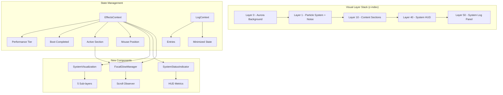

# Design Document: AI Dashboard Transformation

## Overview

This design transforms the existing Next.js 14 portfolio into a "Live AI System Dashboard" experience. Rather than rebuilding, it enhances existing components to create a multi-layered, interactive system that feels alive — with visual depth, persistent HUD indicators, focal glow hierarchy, and narrative-driven scroll transitions.

The transformation touches 10 existing component files, creates 3 new components, and modifies the page layout and styles. The core philosophy: every layer serves a purpose (background atmosphere → mid-level particles → foreground content → top-level HUD + logs), and only one focal point draws attention at any time.

**Key Design Decisions:**
- **Enhancement over rebuild**: All existing effects (ParticleSystem, AuroraBackground, BootSequence, SystemLogPanel, TechGraph, ProjectSystemView, ContextCursor, MagneticWrapper) are enhanced in-place
- **Multi-layer depth system**: 4 visual layers (Background, Mid, Front, Top) managed through z-index hierarchy
- **Focal glow exclusivity**: Only one "lit" section at a time — IntersectionObserver-driven
- **Performance-first**: All new effects respect the existing EffectsContext performance tier system

---

## Visual Blueprint & Composition Rules

### Page-Level Spatial Blueprint

```
┌─────────────────────────────────────────────────────────────────┐
│ [DASHBOARD SHELL LABEL — centered, top 12px, z-40]             │
│                                           [HUD — top-right 16px]│
├─────────────────────────────────────────────────────────────────┤
│                                                                 │
│  ┌─── HERO (100vh, full bleed) ──────────────────────────────┐  │
│  │                                                           │  │
│  │  ┌─ Left 55% ─────────┐  ┌─ Right 45% ──────────────┐   │  │
│  │  │                     │  │                           │   │  │
│  │  │  [Name — text-7xl]  │  │   ╔═══════════════════╗   │   │  │
│  │  │  [tracking: -0.03em]│  │   ║                   ║   │   │  │
│  │  │  [weight: 800]      │  │   ║  SYSTEM VIZ       ║   │   │  │
│  │  │                     │  │   ║  (400×400px area)  ║   │   │  │
│  │  │  [Tagline — 65% op] │  │   ║                   ║   │   │  │
│  │  │  [text-xl, max-w-lg]│  │   ╚═══════════════════╝   │   │  │
│  │  │                     │  │   Centered vertically      │   │  │
│  │  │  [CTAs — gap-4]     │  │   with 60px glow bleed    │   │  │
│  │  │  [glow: idle state] │  │                           │   │  │
│  │  └─────────────────────┘  └───────────────────────────┘   │  │
│  │                                                           │  │
│  │  [Particles: full hero area, z-1]                         │  │
│  │  [Aurora: 2 blobs, bottom-left + top-right]               │  │
│  └───────────────────────────────────────────────────────────┘  │
│                                                                 │
│  ┌─── SYSTEM PROFILE (py-24) ────────────────────────────────┐  │
│  │  max-w-6xl mx-auto, px-6                                 │  │
│  │  [Heading: text-4xl, mb-12]                               │  │
│  │  [Content: text-base, opacity 85%]                        │  │
│  └───────────────────────────────────────────────────────────┘  │
│                                                                 │
│  ┌─── TECH NETWORK (py-24) ──────────────────────────────────┐  │
│  │  max-w-6xl mx-auto, px-6                                 │  │
│  │  [Heading: text-4xl, mb-12]                               │  │
│  │  [TechGraph: 100% width, aspect-[16/9], min-h-[500px]]   │  │
│  └───────────────────────────────────────────────────────────┘  │
│                                                                 │
│  ┌─── ACTIVE SYSTEMS (py-32 — MORE SPACE) ───────────────────┐  │
│  │  max-w-6xl mx-auto, px-6                                 │  │
│  │  [Heading: text-4xl, mb-16]                               │  │
│  │                                                           │  │
│  │  ┌─── VoiceOwl Card (col-span-2, full width) ──────────┐ │  │
│  │  │  min-h-[400px], p-8                                  │ │  │
│  │  │  Background: radial gradient from center             │ │  │
│  │  │  Border: animated gradient (neon→purple, 3s loop)    │ │  │
│  │  │  ┌─────────────────────────────────────────────────┐ │ │  │
│  │  │  │ [PRIMARY SYSTEM] badge — top-left               │ │ │  │
│  │  │  │ [Title — text-3xl, font-bold]                   │ │ │  │
│  │  │  │ [Metrics row — 3 badges, gap-3]                 │ │ │  │
│  │  │  │ [Description — max-w-2xl]                       │ │ │  │
│  │  │  │ [Explore System → button, bottom-right]         │ │ │  │
│  │  │  └─────────────────────────────────────────────────┘ │ │  │
│  │  └──────────────────────────────────────────────────────┘ │  │
│  │                                                           │  │
│  │  ┌─ Card ─┐  ┌─ Card ─┐  (grid-cols-2, gap-6)           │  │
│  │  │ 200px  │  │ 200px  │  Standard: border 10% white      │  │
│  │  │ min-h  │  │ min-h  │  No glow, subdued                │  │
│  │  └────────┘  └────────┘                                   │  │
│  └───────────────────────────────────────────────────────────┘  │
│                                                                 │
│  ┌─── EXECUTION TIMELINE (py-24) ────────────────────────────┐  │
│  │  max-w-4xl mx-auto, px-6                                 │  │
│  │  [Heading: text-4xl, mb-12]                               │  │
│  │  [Timeline entries: vertical line, staggered]             │  │
│  └───────────────────────────────────────────────────────────┘  │
│                                                                 │
│                                    [LOG PANEL — bottom-right,   │
│                                     300×320px, z-50]            │
└─────────────────────────────────────────────────────────────────┘
```

### Composition Rules (CRITICAL)

#### Spacing Rhythm
| Element | Vertical Padding | Bottom Margin |
|---------|-----------------|---------------|
| Hero section | 0 (full 100vh) | 0 |
| Standard sections | py-24 (96px top/bottom) | 0 |
| Active Systems section | py-32 (128px top/bottom) | 0 — extra breathing room for VoiceOwl |
| Section headings | mb-12 (48px) | — |
| VoiceOwl vs other cards | mb-8 (32px gap below VoiceOwl) | — |
| Inter-card gap | gap-6 (24px) | — |

#### Visual Weight Distribution
```
Hero:            ████████████████████ (100% — peak visual weight)
System Profile:  ██████               (30% — quiet, informational)
Tech Network:    █████████            (45% — interactive but contained)
Active Systems:  ████████████████     (80% — VoiceOwl dominates)
Execution Log:   ██████               (30% — quiet, timeline)
```

#### Contrast Strategy
- **Foreground text on hero**: `text-white` (100% opacity for name only)
- **Taglines/subtitles**: 60-70% opacity (`text-white/65`)
- **Section body text**: 80-85% opacity (`text-gray-300`)
- **Non-focal sections**: additional 75% opacity multiplier via FocalGlowManager
- **VoiceOwl card body**: 90% text opacity (elevated vs standard cards at 80%)
- **Standard card text**: 75% opacity

#### Glow Budget (STRICT — only these elements glow)

**Attention Priority within Hero (CRITICAL):**
```
PRIMARY:     Name (text-7xl, pure white, 100% opacity) — THE anchor
SECONDARY:   SystemVisualization (reduced 30% from max — core glow at 0.25, not 0.4)
TERTIARY:    CTA Buttons (reduced 20% from max — idle glow at 0.3, not 0.4)
```
The name wins by typographic dominance (size + weight + contrast). The visualization provides atmosphere but does NOT compete. CTAs are discoverable but recessive.

| Element | Glow Style | When | Notes |
|---------|-----------|------|-------|
| System Visualization (core) | `0 0 40px rgba(0,212,255,0.25), 0 0 80px rgba(139,92,246,0.10)` | Always (pulsing) | REDUCED 30% from earlier spec to not compete with name |
| CTA Buttons | `0 0 12px rgba(0,212,255,0.3)` | Idle | REDUCED 20% — discoverable but not screaming |
| CTA Buttons (hover) | `0 0 25px rgba(0,212,255,0.6), 0 0 50px rgba(139,92,246,0.3)` | Hover | Full intensity on interaction |
| VoiceOwl Card | `0 0 20px rgba(0,212,255,0.25)` | Hover only | Border animation also hover-only |
| Tech_Graph nodes | `0 0 8px {categoryColor}` at 50% opacity | Hover only | — |
| Everything else | **NO GLOW** | — | Enforced via shared utility classes |

**Glow Enforcement Strategy:** All glow is applied ONLY via the utility classes defined in globals.css (`.glow-neon-idle`, `.glow-neon-hover`, `.glow-voiceowl-hover`). Components MUST use these classes rather than inline box-shadow values. This prevents drift.

### Hero System Visualization — Precise Layering

```
┌─────────────────────────────────────────┐
│                                         │
│         ┌─ Layer 5: Particles ─┐        │  ← Canvas, z-index: 4
│         │  15-20 dots, 1-2px   │        │     opacity: 0.4
│         │  react to cursor     │        │     blend-mode: screen
│         │                      │        │
│         │   ┌─ Layer 3: Nodes ──────┐   │  ← SVG group, z-index: 3
│         │   │  6-8 circles, r=4px   │   │     6 nodes in hexagonal layout
│         │   │  connected by lines   │   │     lines: 1px, 15% opacity
│         │   │  sine oscillation     │   │     nodes: solid fill, 80% opacity
│         │   │                       │   │
│         │   │  ╔═ Layer 4: Core ═╗  │   │  ← SVG circle, z-index: 2
│         │   │  ║  r=30px center  ║  │   │     scale: 0.9→1.1 (3s loop)
│         │   │  ║  neon↔purple    ║  │   │     glow: 0 0 40px at 40% opacity
│         │   │  ╚═════════════════╝  │   │
│         │   └───────────────────────┘   │
│         │                              │
│         │  ┌─ Layer 2: Ring ─────────┐  │  ← SVG circle, z-index: 1
│         │  │  r=140px, dashed stroke │  │     stroke-dasharray: 8 12
│         │  │  rotate: 360° in 20s   │  │     stroke: white at 20%
│         │  │  stroke-width: 1px     │  │     continuous CSS rotation
│         │  └────────────────────────┘  │
│         └──────────────────────────────┘
│                                         │
│  ┌─ Layer 1: Background Glow ─────────┐ │  ← Div, z-index: 0
│  │  radial-gradient from center        │ │     400×400px container
│  │  neon-blue at 0%, transparent 70%   │ │     opacity pulse: 0.3→0.5 (4s)
│  │  blur: 60px                         │ │     filter: blur(60px)
│  └─────────────────────────────────────┘ │
│                                         │
└─────────────────────────────────────────┘
  Total container: 400×400px (desktop)
  Mobile: 300×300px, centered above identity
  Bleed/overflow visible: 60px beyond container (glow spillover)
```

### VoiceOwl Card — Visual Composition

```
┌─────────────────────────────────────────────────────────────────┐
│  Background: radial-gradient(ellipse at 30% 50%,               │
│              rgba(0,212,255,0.05) 0%, transparent 60%)          │
│                                                                 │
│  Border: 1px solid animated                                     │
│  (gradient rotates: conic-gradient cycling neon→purple→neon)    │
│                                                                 │
│  ┌─────────────────────────────────────────────────────────┐   │
│  │                                                         │   │
│  │  [PRIMARY SYSTEM]  ← monospace, text-xs, neon-blue bg   │   │
│  │                       px-3 py-1, rounded-full           │   │
│  │                       letter-spacing: 0.1em             │   │
│  │                                                         │   │
│  │  VoiceOwl AI       ← text-3xl, font-bold, white        │   │
│  │                       mt-3, tracking-tight              │   │
│  │                                                         │   │
│  │  ┌───────┐ ┌────────────────┐ ┌───────────┐            │   │
│  │  │ 2M+   │ │ Real-time AI   │ │ 99.9%     │  ← Metrics│   │
│  │  │ daily │ │ call routing   │ │ uptime    │    text-xs │   │
│  │  │ API   │ │                │ │           │    px-3    │   │
│  │  └───────┘ └────────────────┘ └───────────┘    py-1.5  │   │
│  │  gap-3, mt-4                                    bg:     │   │
│  │                                                 neon/10%│   │
│  │                                                 border: │   │
│  │  [Description text, max-w-2xl, opacity 80%]     neon/20%│   │
│  │                                                         │   │
│  │                                                         │   │
│  │                              ┌─────────────────────┐    │   │
│  │                              │  Explore System →   │    │   │
│  │                              │  (btn, neon glow)   │    │   │
│  │                              └─────────────────────┘    │   │
│  │                                                         │   │
│  └─────────────────────────────────────────────────────────┘   │
│  Padding: p-8 (32px all sides)                                 │
│  min-height: 400px desktop, 320px mobile                       │
│  Hover: box-shadow 0 0 20px rgba(0,212,255,0.25)              │
│         border animates (visible only on hover)                 │
└─────────────────────────────────────────────────────────────────┘

Standard cards (below):
┌──────────────┐  ┌──────────────┐
│  min-h: 200px│  │  min-h: 200px│  ← NO glow, NO animated border
│  p-6         │  │  p-6         │     border: white at 10%
│  border: 10% │  │  border: 10% │     text: 75% opacity
│  subdued     │  │  subdued     │     bg: black/30 + backdrop-blur-sm
└──────────────┘  └──────────────┘
```

### Motion Layering Rules

| Layer | Element | Motion Type | Speed | Easing |
|-------|---------|-------------|-------|--------|
| Background (z-0) | Aurora blobs | CSS keyframes, translate | 15-30s per cycle | linear |
| Mid (z-1) | Particles | Canvas rAF, position + opacity | 60fps, slow drift | linear |
| Mid (z-1) | Particle parallax | Transform offset on cursor | Immediate (lerped 0.05) | ease-out |
| Content (z-10) | Section entrance | Framer Motion, y+opacity | 400-600ms | easeOut |
| Content (z-10) | Card tilt | CSS transform, perspective | Immediate (lerped 0.1) | — |
| Content (z-10) | Magnetic pull | Transform translate | Immediate / 300ms return | easeOut return |
| Content (z-10) | Focal dimming | Opacity transition | 400ms | ease |
| Overlay (z-30) | SystemVisualization | SVG + Framer, multi-speed | See layer breakdown | — |
| Top (z-40) | HUD blink | CSS animation | 1.5s interval | step-end |
| Top (z-40) | HUD latency | JS interval, text update | 2-4s | — |
| Top (z-50) | Log entries | Framer, x+opacity | 250ms | easeOut |

### Animation Priority Tiers (CRITICAL — Prevents Cognitive Fatigue)

Running all animations simultaneously creates cognitive overload and performance risk. Animations are categorized into tiers that map to performance levels:

| Tier | Animations | Active When | Rationale |
|------|-----------|-------------|-----------|
| **Tier 1 (Essential)** | Core pulse (3s), Aurora CSS (idle), Focal dimming, Section entrances, Log entries | ALL tiers (high, medium, low) | These are the minimum viable "alive" feeling. Even low-end devices run these. |
| **Tier 2 (Enhancement)** | Ring rotation (20s), Node oscillation (3-4s), Particle drift, HUD blink, Card tilt | High + Medium tiers only | Adds depth but not essential. Disabled on low to save budget. |
| **Tier 3 (Premium)** | Cursor trail, Particle parallax/repulsion, Canvas micro-particles (Layer 5), VoiceOwl border animation | High tier only | Cursor-reactive effects are expensive. Only on capable devices. |

**Implementation:**
```typescript
// In each component, check tier before enabling animations:
const { performanceTier } = useEffects();

// Tier 1: Always active
const coreAnimationsEnabled = true;

// Tier 2: Medium+
const enhancedAnimationsEnabled = performanceTier !== 'low';

// Tier 3: High only
const premiumAnimationsEnabled = performanceTier === 'high';
```

**Cognitive Load Rule:** At any given moment, the user's eye should track at most 2 moving things in their peripheral vision. The tier system ensures:
- Low: 1-2 subtle movements (core pulse + aurora drift)
- Medium: 3-4 movements (+ ring + nodes)
- High: full experience but still bounded by the focal glow system (only active section is bright)

### Typography Scale (Exact Values)

| Element | Desktop (≥1024px) | Tablet (768-1023px) | Mobile (<768px) | Weight | Tracking | Opacity |
|---------|-------------------|---------------------|-----------------|--------|----------|---------|
| Hero name | text-7xl (72px) | text-6xl (60px) | text-5xl (48px) | 800 | -0.03em | 100% |
| Hero tagline | text-xl (20px) | text-lg (18px) | text-base (16px) | 400 | normal | 65% |
| Section headings | text-4xl (36px) | text-3xl (30px) | text-2xl (24px) | 700 | -0.02em | 90% |
| Card title (VoiceOwl) | text-3xl (30px) | text-2xl (24px) | text-xl (20px) | 700 | -0.01em | 100% |
| Card title (standard) | text-xl (20px) | text-lg (18px) | text-base (16px) | 600 | normal | 85% |
| Body text | text-base (16px) | text-base (16px) | text-sm (14px) | 400 | normal | 80% |
| HUD/monospace | 11px fixed | 11px fixed | 10px fixed | 400 | 0.05em | 70% |
| Badge text | text-xs (12px) | text-xs (12px) | text-xs (12px) | 500 | 0.05em | 90% |
| Dashboard label | 11px fixed | 11px fixed | 11px fixed | 400 | 0.1em | 60% |

### Section Density & Breathing Room

| Section | Content Density | Intent |
|---------|----------------|--------|
| Hero | LOW — only name, tagline, 2 CTAs, visualization | Maximum breathing room, cinematic |
| System Profile | MEDIUM — bio text, brief | Quick read, not overwhelming |
| Tech Network | MEDIUM — graph fills space visually | Interactive focus, graph dominates |
| Active Systems | HIGH at VoiceOwl, LOW for rest | VoiceOwl is dense, others sparse |
| Execution Timeline | MEDIUM — timeline entries | Scannable, rhythmic |

### ProjectSystemView — Full-Screen Dashboard Layout

```
┌─────────────────────────────────────────────────────────────────┐
│  fixed inset-0, z-[60], bg-[#020617]/95, backdrop-blur-xl      │
│                                                                 │
│  ┌─ Header Bar ─────────────────────────────────────────────┐  │
│  │  h-16, border-b border-white/10                          │  │
│  │  [● SYSTEM ACTIVE]  [VoiceOwl AI]        [✕ Close]      │  │
│  └──────────────────────────────────────────────────────────┘  │
│                                                                 │
│  ┌─ Metrics Row (grid-cols-3, gap-6, p-8) ──────────────────┐  │
│  │  ┌──────────┐  ┌──────────────┐  ┌──────────────┐       │  │
│  │  │ API Reqs │  │ Avg Latency  │  │   Uptime     │       │  │
│  │  │ 2,847,391│  │    42ms      │  │   99.97%     │       │  │
│  │  │ (counter │  │ (fluctuates  │  │ (static)     │       │  │
│  │  │  animates│  │  ±5ms/3s)    │  │              │       │  │
│  │  │  on open)│  │              │  │              │       │  │
│  │  └──────────┘  └──────────────┘  └──────────────┘       │  │
│  │  Each: p-6, bg-white/5, border border-white/10, rounded  │  │
│  └──────────────────────────────────────────────────────────┘  │
│                                                                 │
│  ┌─ Architecture Panel (p-8) ───────────────────────────────┐  │
│  │  [System Architecture Diagram — simplified flow]          │  │
│  │  Shows: Input → AI Router → Voice Engine → Output         │  │
│  │  Style: node-edge diagram, monospace labels               │  │
│  └──────────────────────────────────────────────────────────┘  │
│                                                                 │
│  ┌─ Tech + Actions Row (grid-cols-2, gap-6, p-8) ───────────┐ │
│  │  ┌─ Tech Stack ──────┐  ┌─ Links ──────────────────────┐ │ │
│  │  │ [pill] [pill] ... │  │ [GitHub →]  [Live Demo →]    │ │ │
│  │  └───────────────────┘  └─────────────────────────────┘ │ │
│  └──────────────────────────────────────────────────────────┘ │
│                                                                 │
└─────────────────────────────────────────────────────────────────┘
```

## Architecture



**Scroll-Driven Narrative Flow:**
```
BOOT (BootSequence overlay)
  → SYSTEM ONLINE (Hero reveals with HUD + visualization)
    → MODULES LOADED (Skills/TechGraph animates in)
      → CORE SYSTEM (VoiceOwl flagship dominates)
        → EXECUTION LOG (Experience timeline)
```

### Z-Index Layer Map (Complete)

| z-index | Layer | Component | Position | Blend Mode |
|---------|-------|-----------|----------|------------|
| 0 | Background | Aurora blobs + page bg | `fixed inset-0` | normal |
| 1 | Mid-atmosphere | ParticleSystem canvas + NoiseTexture | `fixed inset-0` | screen (particles), overlay (noise) |
| 10 | Content | All sections (Hero, About, Skills, Projects, Experience, Contact) | `relative` | normal |
| 30 | Visualization overlay | SystemVisualization (within Hero) | `relative` within hero right column | normal |
| 40 | HUD | SystemStatusIndicator + Dashboard shell label | `fixed` top | normal |
| 50 | Log panel | SystemLogPanel | `fixed` bottom-right | normal |
| 60 | Full-screen overlay | ProjectSystemView (when open) | `fixed inset-0` | normal |
| 70 | Boot overlay | BootSequence (during boot only) | `fixed inset-0` | normal |

## Components and Interfaces

### New Components

#### 1. `SystemVisualization` — `src/components/effects/SystemVisualization.tsx`

Multi-layered animated element rendered in the Hero's right column (replacing the profile image).

```typescript
interface SystemVisualizationProps {
  performanceTier: 'high' | 'medium' | 'low';
  mousePosition: { x: number; y: number };
  reducedMotion: boolean;
}
```

**Container:** 400×400px on desktop (≥1024px), 320×320px on tablet (768-1023px), 280×280px on mobile (<768px). Centered vertically in the right column. `overflow: visible` to allow glow bleed of 60px beyond container edges.

**5 Visual Sub-Layers (Precise Spec):**

| Layer | Element | Size | Animation | Color | Opacity | Low Perf |
|-------|---------|------|-----------|-------|---------|----------|
| 1 | Radial glow div | 400×400px, filter: blur(60px) | opacity: 0.3→0.5 over 4s, ease-in-out, infinite | radial-gradient: neon-blue center → transparent 70% | 0.3-0.5 | Static at 0.3 |
| 2 | SVG circle (ring) | r=140px, stroke-width: 1px | CSS rotate: 0→360° in 20s, linear, infinite | stroke: white, stroke-dasharray: 8 12 | 0.2 | Static, no rotation |
| 3 | SVG group (nodes) | 6 circles, r=4px each, hexagonal layout within r=100px | Each node: sine oscillation on x/y, amplitude 2-3px, offset phase per node, period 3-4s | fill: neon-blue, nodes connected by lines stroke-width: 1px | Nodes: 0.8, Lines: 0.15 | Static positions |
| 4 | SVG circle (core) | r=30px, centered | Framer Motion: scale 0.9→1.1 over 3s loop, glow shadow pulses | fill: gradient neon-blue→purple | 1.0, shadow via `.glow-viz-core` (0 0 40px at 0.25) | Static, no scale |
| 5 | Canvas overlay | 400×400px, positioned absolute over SVG | 15-20 micro-particles (r=1-2px), drift slowly, react to cursor within 80px radius | fill: white | 0.4, blend-mode: screen | Hidden entirely |

**SVG ViewBox:** `0 0 400 400` — all coordinates relative to this space.

**Node Hexagonal Layout (Layer 3):**
```
Positions (cx, cy) relative to center (200, 200):
  Node 1: (200, 120)   — top
  Node 2: (270, 160)   — top-right
  Node 3: (270, 240)   — bottom-right
  Node 4: (200, 280)   — bottom
  Node 5: (130, 240)   — bottom-left
  Node 6: (130, 160)   — top-left

Connections (lines between):
  1↔2, 2↔3, 3↔4, 4↔5, 5↔6, 6↔1 (outer ring)
  1↔4, 2↔5, 3↔6 (cross connections — rendered at 10% opacity)
```

**Cursor Reactivity (Layer 5 canvas):**
- When cursor enters SystemVisualization container area, particles within 80px of cursor position accelerate away (repulsion) by 2-4px per frame
- When cursor leaves, particles slowly drift back to idle positions over 1-2s
- Particle draw: `ctx.arc(x, y, radius, 0, Math.PI * 2)` + `ctx.fill()` — minimal draw calls

**Rendering approach:** Layers 1-4 use SVG + Framer Motion. Layer 5 uses a small dedicated canvas element for cursor-reactive particles (separate from the global ParticleSystem).

**Incremental Build Strategy (IMPORTANT):**
The SystemVisualization is complex (5 layers + interactions). Build incrementally:
```
Phase 1 (Core — always renders):
  Layer 1: Background glow (CSS only, no JS)
  Layer 4: Pulsing core (Framer Motion scale + glow)

Phase 2 (Enhancement — Tier 2+):
  Layer 2: Rotating ring (CSS animation)
  Layer 3: Network nodes (SVG + sine oscillation)

Phase 3 (Premium — Tier 3 only):
  Layer 5: Canvas micro-particles (cursor reactive)
```
Each phase is a separate `<group>` or element that conditionally renders based on `performanceTier`. This makes it debuggable, tunable, and progressive.

#### 2. `SystemStatusIndicator` — `src/components/effects/SystemStatusIndicator.tsx`

Persistent HUD element fixed to top-right corner.

```typescript
interface SystemStatusIndicatorProps {}
// Consumes EffectsContext internally for bootCompleted and activeSection
```

**Positioning & Dimensions:**
- Desktop: `fixed top-4 right-6` (16px top, 24px right)
- Container: `flex items-center gap-4`, no background (floats cleanly over content)
- Total width: ~280px on desktop
- z-index: 40 (above content, below log panel and overlays)

**Display (desktop ≥768px):**
```
● ONLINE    LATENCY: 32ms    MODULES: 6 ACTIVE
│           │                 │
│           │                 └─ text-[11px], monospace, white/70
│           └─ text-[11px], monospace, white/70, tabular-nums
└─ 8×8px circle, bg-green-400, animate-pulse (CSS), mr-2
```

All text: `font-mono text-[11px] uppercase tracking-[0.05em] text-white/70`

**Display (mobile <768px):**
```
● ONLINE
```
Only status dot + "ONLINE" text, positioned `fixed top-3 right-4`

**Behavior:**
- Hidden during boot sequence (renders nothing while `bootCompleted === false`)
- Fades in: opacity 0→0.7 over 400ms, triggered when `bootCompleted` becomes true
- Latency: initializes to random value in 28-35ms range, updates every 2-4s (random interval) with ±5ms fluctuation
- Module count: reads from EffectsContext, increments as sections become visible (starts at 1 on hero, max 6)
- Green dot CSS: `animation: pulse 1.5s ease-in-out infinite` with scale(1→1.3→1) + opacity(1→0.7→1)

**The point:** This tiny element makes the entire page feel "connected" — like it's a real system reporting health. It's subtle (70% opacity, 11px) but its presence subconsciously reinforces the dashboard narrative.

#### 3. `FocalGlowManager` — `src/components/effects/FocalGlowManager.tsx`

Manages which section is "lit" at any time. Uses IntersectionObserver on all sections to determine which is closest to viewport center.

```typescript
interface FocalGlowManagerProps {
  children: React.ReactNode;
}
// Wraps the main content in page.tsx
// Applies opacity dimming to non-focal sections via CSS classes
```

**Logic:**
- Uses a **single merged IntersectionObserver** shared with SectionWrapper (NOT a separate observer per component — avoids dual-observer conflict)
- The merged observer is created once in EffectsContext with `threshold: [0, 0.25, 0.3, 0.5, 0.75, 1.0]` (combines FocalGlow thresholds + SectionWrapper's 0.3 trigger)
- On each intersection callback, calculates which section's center is closest to viewport center (using `entry.boundingClientRect`)
- **Debounces** focal section changes by 80ms to prevent flickering on fast scroll
- Applies `data-focal="true"` attribute to the active section's container
- Non-focal sections receive `opacity: 0.85` (not 0.75 — subtle dimming, avoids "washed out" feel on text)
- Focal section stays at `opacity: 1.0`
- Also fires `onSectionVisible` callback for SectionWrapper stagger triggers (single observer, dual purpose)

**Merged Observer Architecture:**
```typescript
// In EffectsContext — single observer for all sections
const sectionObserver = new IntersectionObserver(
  (entries) => {
    entries.forEach(entry => {
      // Purpose 1: FocalGlow — track which section is closest to center
      updateFocalSection(entry);
      
      // Purpose 2: SectionWrapper — trigger entrance animation at 0.3 threshold
      if (entry.intersectionRatio >= 0.3 && !animatedSections.has(entry.target.id)) {
        triggerSectionEntrance(entry.target.id);
        animatedSections.add(entry.target.id);
      }
      
      // Purpose 3: Module count — track visible sections for HUD
      updateModuleCount(entry);
    });
  },
  { threshold: [0, 0.25, 0.3, 0.5, 0.75, 1.0] }
);
```

**CSS Implementation:**
```css
/* Applied via FocalGlowManager to the wrapping container */
[data-focal-container] > section {
  transition: opacity 400ms ease, filter 400ms ease;
  opacity: 0.85;
  filter: blur(0px);  /* ready for optional blur, not applied by default */
}

[data-focal-container] > section[data-focal="true"] {
  opacity: 1.0;
  filter: blur(0px);
}

/* Optional: on high-performance tier, add 0.5px blur to non-focal for extra depth */
[data-focal-container][data-perf="high"] > section:not([data-focal="true"]) {
  filter: blur(0.3px);
}
```

**Why 0.85 not 0.75:** At 0.75, text-heavy sections (System Profile, Execution Timeline) look faded and unreadable. 0.85 is perceptible as "not the focus" without making content look broken. The optional 0.3px blur (high perf only) adds depth without readability cost.

**Visual Effect:**
- Creates a "spotlight" feel — the section you're looking at is bright, everything else recedes
- This is primarily opacity-based (not motion-based), so it works even with `prefers-reduced-motion`
- The Hero section starts as focal on page load
- Transition between focal sections is smooth (400ms), not jarring
- Debounce prevents rapid flickering when scrolling quickly through sections

### Enhanced Existing Components

#### 4. `Hero.tsx` — Enhanced

**Changes:**
- Remove profile image → Replace with `<SystemVisualization />`
- Change name from `text-6xl` to `text-5xl md:text-7xl` with `tracking-[-0.03em]` and `font-extrabold` (weight 800)
- Update tagline to "I build real-time AI backend systems and scalable architectures." at 65% opacity, `text-xl`, `max-w-lg`
- Add neon-blue idle glow via `.glow-neon-idle` class (`box-shadow: 0 0 12px rgba(0, 212, 255, 0.3)`) to CTA buttons — reduced intensity so buttons don't compete with name
- Two-column layout: left 55% (identity + CTAs), right 45% (SystemVisualization, vertically centered)
- Full `h-screen` (100vh) with `flex items-center` to vertically center content
- `overflow: hidden` on hero container (particles and glow bleed handled by fixed-position layers)

**Layout Composition (Desktop ≥1024px):**
```
.hero {
  height: 100vh;
  display: flex;
  align-items: center;
  padding: 0 clamp(24px, 5vw, 96px);  /* responsive horizontal padding */
  position: relative;
  z-index: 10;
}

.hero-left {
  flex: 0 0 55%;
  display: flex;
  flex-direction: column;
  gap: 24px;  /* between name, tagline, CTAs */
}

.hero-right {
  flex: 0 0 45%;
  display: flex;
  align-items: center;
  justify-content: center;
}
```

**Visual Weight Breakdown:**
- Name: 72px (text-7xl), weight 800, tracking -0.03em, color: pure white — THIS is the anchor
- Tagline: 20px, weight 400, color: white at 65% opacity — secondary, does NOT compete
- CTAs: 2 buttons, gap-4, each with idle glow — draws eye after name
- SystemVisualization: 400×400px, pulsing/rotating — creates atmosphere but doesn't steal from name

**Mobile (< 768px):**
- Stack vertically: SystemVisualization on top (min(280px, 35vh), centered), Identity below
- Name scales to text-5xl (48px)
- Maintain 100vh
- CTAs become full-width
- Gap between visualization and identity: `clamp(16px, 3vh, 32px)`
- Visualization container has `overflow: visible` capped to prevent bleed off-screen

**Tablet (768–1023px):**
- Two-column layout: 50/50 split (vs 55/45 on desktop)
- SystemVisualization: 320×320px
- Name: text-6xl (60px), weight 800, tracking -0.03em
- Tagline: text-lg (18px)
- Padding: `px-8` (32px horizontal)
- Same vertical centering as desktop (flex items-center, h-screen)

#### 5. `page.tsx` — Enhanced

**Changes:**
- Add `SystemStatusIndicator` (dynamic import, ssr: false) — `fixed top-4 right-6 z-40`
- Add `FocalGlowManager` wrapping content sections
- Add `AuroraBackground` component (dynamic import, ssr: false) — `fixed inset-0 z-0`
- Add `NoiseTexture` component — `fixed inset-0 z-[1] pointer-events-none`
- Add `SystemLogPanel` (dynamic import, ssr: false) — `fixed bottom-4 right-4 z-50`
- Add Dashboard Shell label element — `fixed top-3 left-1/2 -translate-x-1/2 z-40`

**Dashboard Shell Label:**
```html
<span class="fixed top-3 left-1/2 -translate-x-1/2 z-40
             font-mono text-[11px] uppercase tracking-[0.1em] text-white/60
             opacity-0 animate-fadeIn"
      style="animation-delay: 300ms; animation-fill-mode: forwards;">
  SYSTEM DASHBOARD
</span>
```
- Position: top-center of viewport, 12px from top
- Font: monospace, 11px, uppercase, tracking 0.1em (very wide spacing)
- Color: white at 60% opacity (subtle, does not compete)
- Appears 300ms after boot completes with a 500ms fade-in
- No background, no border — just floating text

**Page Body:**
```css
body {
  background-color: #020617;  /* deep dark */
  color: white;
  overflow-x: hidden;
}
```

#### 6. `SectionWrapper.tsx` — Enhanced

**Changes:**
- Add stagger delay support: children animate in with 100-200ms sequential delays
- Use `calculateStaggerDelays` from layout-utils for timing
- Increase entrance motion to `y: 50` (from y: 40) for stronger "module loading" feel
- Fire section visibility to EffectsContext for module count tracking
- Entrance trigger: 30% of section visible in viewport (IntersectionObserver threshold: 0.3)

**Stagger Animation Spec:**
```
Section enters viewport (30% visible):
  t=0ms:     Section heading fades in (opacity 0→1, y: 50→0)
  t=150ms:   First child element fades in
  t=300ms:   Second child element fades in
  t=450ms:   Third child element fades in
  ...
  
  Each child: duration 500ms, easeOut
  Max total stagger: 1200ms (after which remaining children appear together)
```

**Framer Motion Config:**
```typescript
const containerVariants = {
  hidden: { opacity: 0 },
  visible: {
    opacity: 1,
    transition: {
      staggerChildren: 0.15,  // 150ms between each child
      delayChildren: 0.1,     // 100ms before first child starts
    }
  }
};

const childVariants = {
  hidden: { opacity: 0, y: 50 },
  visible: { 
    opacity: 1, 
    y: 0,
    transition: { duration: 0.5, ease: [0.25, 0.46, 0.45, 0.94] } // easeOutQuad
  }
};
```

**"Module Loading" Feel:** The stagger creates the impression that each section's content is being "loaded" sequentially — like a system booting modules one by one. Combined with the FocalGlow (dimming other sections), it creates narrative progression.

#### 7. `About.tsx` — Heading Change

- Change heading from "About Me" → "System Profile"

#### 8. `Skills.tsx` — Heading Change

- Change heading from "Skills" → "Tech Network"

#### 9. `Projects.tsx` — Enhanced

**Changes:**
- Change heading from "Projects" → "Active Systems"
- Extra vertical padding: `py-32` instead of `py-24` (128px gives VoiceOwl breathing room)
- VoiceOwl_Card: `col-span-2` (full grid width), min-h-[400px], animated gradient border, internal radial gradient background
- Standard cards: grid-cols-2, gap-6, min-h-[200px], border at `border-white/[0.10]`, subdued text at 75% opacity
- Gap between VoiceOwl and standard cards: `mb-8` (32px)
- VoiceOwl background gradient: `radial-gradient(ellipse at 30% 50%, rgba(0,212,255,0.05) 0%, transparent 60%)`

**Grid Layout:**
```css
.projects-grid {
  display: grid;
  grid-template-columns: repeat(2, 1fr);
  gap: 24px;  /* gap-6 */
}

.voiceowl-card {
  grid-column: 1 / -1;  /* full width */
  min-height: 400px;
  padding: 32px;
  position: relative;
  overflow: hidden;
  /* animated border via pseudo-element with conic-gradient */
}

.standard-card {
  min-height: 200px;
  padding: 24px;
  background: rgba(0, 0, 0, 0.3);
  backdrop-filter: blur(4px);
  border: 1px solid rgba(255, 255, 255, 0.10);
  /* NO glow, NO animated border */
}
```

#### 10. `Experience.tsx` — Heading Change

- Change heading from "Experience" → "Execution Timeline"

#### 11. `ProjectCard.tsx` — Enhanced (VoiceOwl variant)

**Changes:**
- Accept `isFeatured` prop
- When featured:
  - Render animated border: use a `::before` pseudo-element (or wrapper div) with `conic-gradient(from var(--angle), #00d4ff, #8b5cf6, #00d4ff)` that rotates via CSS `@property --angle` animation over 3s
  - Badge: `[PRIMARY SYSTEM]` in monospace, text-xs, bg-[#00d4ff]/10, border border-[#00d4ff]/30, px-3 py-1, rounded-full, tracking-[0.1em]
  - Metric badges: row of 3, each with bg-[#00d4ff]/10, border border-[#00d4ff]/20, text-xs, px-3 py-1.5, rounded-md
  - Internal gradient background
  - Title: text-3xl font-bold tracking-tight (vs text-xl for standard)
  - "Explore System →" button with neon glow
  - Hover: `box-shadow: 0 0 20px rgba(0,212,255,0.25)` + border animation visible
- Standard cards:
  - `border-white/[0.10]` (10% white = very subtle)
  - Title: text-xl at 85% opacity
  - Body: 75% opacity
  - Background: `bg-black/30 backdrop-blur-sm`
  - Hover: slight brightness increase (no glow, no animated border)

**Animated Border Implementation (Rotating Pseudo-Element — Cross-Browser):**

⚠️ `@property` is NOT supported in Firefox. Use a rotating pseudo-element instead:

```css
/* The card itself */
.voiceowl-card {
  position: relative;
  border-radius: 16px;
  overflow: hidden;  /* clips the pseudo-element */
}

/* Rotating gradient pseudo-element (sits behind content) */
.voiceowl-card::before {
  content: '';
  position: absolute;
  inset: -1px;  /* 1px border thickness */
  border-radius: inherit;
  background: conic-gradient(from 0deg, #00d4ff, #8b5cf6, #00d4ff);
  animation: rotateBorderPseudo 3s linear infinite;
  z-index: -1;
  opacity: 0;
  transition: opacity 300ms ease;
}

/* Show border only on hover */
.voiceowl-card:hover::before {
  opacity: 1;
}

/* Inner content mask (covers the gradient, leaving only border visible) */
.voiceowl-card::after {
  content: '';
  position: absolute;
  inset: 1px;  /* 1px inset = border width */
  border-radius: calc(16px - 1px);
  background: #020617;
  z-index: -1;
}

@keyframes rotateBorderPseudo {
  to { transform: rotate(360deg); }
}
```

This approach:
- Works in Chrome, Firefox, Safari (no @property needed)
- Pseudo-element rotates behind the card
- Inner `::after` masks the center, leaving only the 1px border visible
- `opacity: 0 → 1` on hover makes it hover-only
- `overflow: hidden` on the card clips any bleed

#### 12. `ProjectSystemView.tsx` — Enhanced as Full-Screen Product Dashboard

**Changes:**
- Expand to true full-screen (`fixed inset-0, z-[60]`, no max-width constraint)
- Background: `bg-[#020617]/95 backdrop-blur-xl` — not fully opaque, shows depth behind
- Add header with blinking green status dot + "SYSTEM ACTIVE" label + project name + close button
- Add live metrics panel: 3 cards in a row, each with animated counter
- Add architecture diagram panel: simplified flow diagram (nodes + arrows)
- Add technology stack panel as pill badges + action links
- Entrance animation: scale 0.95→1.0 + opacity 0→1 over 300ms (feels like system loading)
- **Backdrop Performance:** When ProjectSystemView is open, ALL lower-tier rAF loops (ParticleSystem, SystemVisualization canvas, ContextCursor trail) are paused via `EffectsContext.overlayActive = true`. Only the overlay's own counter animation runs. This prevents hidden elements burning CPU behind the backdrop blur.

**Full Layout Spec:**
```
Container: fixed inset-0, z-[60]
Background: bg-[#020617]/95, backdrop-filter: blur(20px)
Max-content-width: 1200px, centered with mx-auto
Internal padding: p-8

Header: h-16, flex items-center justify-between
  Left: [● green blink] + "SYSTEM ACTIVE" (monospace, text-xs, green)
        + [Project Name] (text-xl, font-bold, white)
  Right: [✕] close button (w-10 h-10, hover:bg-white/10, rounded)

Metrics Row: grid grid-cols-3 gap-6, mt-8
  Each card: p-6, bg-white/[0.03], border border-white/[0.08], rounded-xl
    Label: text-xs, monospace, uppercase, opacity 60%
    Value: text-3xl, font-bold, tabular-nums (for counter animation)
    
  Card 1: "API REQUESTS" / "2,847,391" (animates from 0 over 2s on open)
  Card 2: "AVG LATENCY" / "42ms" (fluctuates ±5ms every 3s after initial)
  Card 3: "UPTIME" / "99.97%" (static)

Architecture Panel: mt-8, p-6, bg-white/[0.03], border border-white/[0.08], rounded-xl
  Height: 200px
  Content: horizontal flow diagram (flexbox with arrows)
    [Input] → [AI Router] → [Voice Engine] → [Output]
    Each node: px-4 py-2, border border-[#00d4ff]/30, rounded, monospace
    Arrows: → character with neon-blue color, or SVG arrow paths

Tech + Actions Row: grid grid-cols-2 gap-6, mt-8
  Left (Tech Stack): flex flex-wrap gap-2
    Each pill: px-3 py-1, text-xs, bg-white/5, border border-white/10, rounded-full
  Right (Actions): flex gap-4, items-center, justify-end
    [GitHub →] [Live Demo →] — buttons with neon glow on hover
```

**Live Counter Animation:**
```typescript
// On mount, animate from 0 to target over 2 seconds using easeOutExpo
const animateCounter = (target: number, duration: number = 2000) => {
  const start = performance.now();
  const update = (now: number) => {
    const elapsed = now - start;
    const progress = Math.min(elapsed / duration, 1);
    const eased = 1 - Math.pow(1 - progress, 4); // easeOutQuart
    setValue(Math.floor(target * eased));
    if (progress < 1) requestAnimationFrame(update);
  };
  requestAnimationFrame(update);
};
```

#### 13. `ParticleSystem.tsx` — Enhanced

**Changes:**
- Add cursor parallax: offset particle render positions by up to 15px based on cursor distance from viewport center
- This creates a subtle "depth shift" when cursor moves across the hero area

#### 14. `Button.tsx` — Enhanced

**Changes:**
- Add idle glow to primary variant via `.glow-neon-idle` class: `box-shadow: 0 0 12px rgba(0, 212, 255, 0.3)`
- Increase hover glow via `.glow-neon-hover` class: `box-shadow: 0 0 25px rgba(0, 212, 255, 0.6), 0 0 50px rgba(139, 92, 246, 0.3)`
- Hover transition: 200ms ease-out (glow intensifies smoothly)
- Add subtle scale on hover: `transform: scale(1.02)` over 200ms
- Border: `border border-[#00d4ff]/30` (idle), `border-[#00d4ff]/60` (hover)
- Background: `bg-[#00d4ff]/10` (idle), `bg-[#00d4ff]/15` (hover)
- MUST use shared `.glow-neon-idle` / `.glow-neon-hover` classes (not inline box-shadow)

**Button States (Primary Variant):**
```
Idle:
  background: rgba(0, 212, 255, 0.10)
  border: 1px solid rgba(0, 212, 255, 0.30)
  box-shadow: 0 0 12px rgba(0, 212, 255, 0.3)  /* .glow-neon-idle — reduced 20% */
  color: #00d4ff
  
Hover:
  background: rgba(0, 212, 255, 0.15)
  border: 1px solid rgba(0, 212, 255, 0.60)
  box-shadow: 0 0 25px rgba(0, 212, 255, 0.6), 0 0 50px rgba(139, 92, 246, 0.3)  /* .glow-neon-hover */
  transform: scale(1.02)
  transition: all 200ms ease-out

Active (pressed):
  transform: scale(0.98)
  box-shadow: 0 0 10px rgba(0, 212, 255, 0.3)
  transition: all 100ms ease-out
```

#### 15. `ContextCursor.tsx` — Enhanced (Cursor Trail)

**Changes:**
- Add a fading trail effect: store last 5-8 positions in a ring buffer (updated every 50ms via throttled mousemove)
- Render trail as fading dots behind the cursor ring
- Trail dots: radius 3px, positioned at historical cursor positions
- Opacity decay: most recent = 60%, each older position -8%, oldest ≈ 10%
- Color: white (matches cursor ring)
- Blend mode: screen (adds to dark background without obscuring content)
- Only active when `performanceTier !== 'low'` and `pointer: fine` (no trail on touch)

**Trail Implementation:**
```
Position buffer: [pos1, pos2, pos3, pos4, pos5, pos6, pos7, pos8]
                  oldest ←──────────────────────────────→ newest

Render each as:
  ctx.globalAlpha = 0.10 + (index / buffer.length) * 0.50
  ctx.beginPath()
  ctx.arc(pos.x, pos.y, 3, 0, Math.PI * 2)
  ctx.fill()
```

### File Change Summary

| File | Change Type | Description |
|------|-------------|-------------|
| `src/components/effects/SystemVisualization.tsx` | **NEW** | Multi-layer animated hero visualization (5 layers, 400×400px) |
| `src/components/effects/SystemStatusIndicator.tsx` | **NEW** | Persistent HUD with live metrics (fixed top-right, z-40) |
| `src/components/effects/FocalGlowManager.tsx` | **NEW** | Scroll-driven focal section management (opacity dimming) |
| `src/components/Hero.tsx` | MODIFY | Replace image with visualization, text-7xl, 100vh, 55/45 split |
| `src/app/page.tsx` | MODIFY | Add new components, dashboard shell label, layer structure |
| `src/components/SectionWrapper.tsx` | MODIFY | Add stagger delays (150ms), y:50 entrance, section tracking |
| `src/components/About.tsx` | MODIFY | Heading → "System Profile" |
| `src/components/Skills.tsx` | MODIFY | Heading → "Tech Network" |
| `src/components/Projects.tsx` | MODIFY | Heading → "Active Systems", py-32, VoiceOwl layout |
| `src/components/Experience.tsx` | MODIFY | Heading → "Execution Timeline" |
| `src/components/ui/ProjectCard.tsx` | MODIFY | Featured card variant with badges, animated border, min-h-[400px] |
| `src/components/effects/ProjectSystemView.tsx` | MODIFY | Full-screen SaaS dashboard (fixed inset-0, z-60) |
| `src/components/effects/ParticleSystem.tsx` | MODIFY | Cursor parallax offset (max 15px) |
| `src/components/ui/Button.tsx` | MODIFY | Idle glow (15px), hover glow (25px+50px), scale on hover |
| `src/components/effects/ContextCursor.tsx` | MODIFY | 8-position cursor trail with opacity decay |
| `src/app/globals.css` | MODIFY | Keyframe animations, glow utilities, focal glow CSS |
| `src/lib/layout-utils.ts` | MODIFY | Add focal glow calculation, parallax utils, stagger utils |

### CSS Additions (`globals.css`)

```css
/* --- Keyframe Animations --- */

@keyframes rotateBorderPseudo {
  to { transform: rotate(360deg); }
}

@keyframes fadeIn {
  from { opacity: 0; }
  to { opacity: 1; }
}

@keyframes pulseGlow {
  0%, 100% { opacity: 0.3; }
  50% { opacity: 0.5; }
}

@keyframes rotateRing {
  from { transform: rotate(0deg); }
  to { transform: rotate(360deg); }
}

@keyframes statusPulse {
  0%, 100% { transform: scale(1); opacity: 1; }
  50% { transform: scale(1.3); opacity: 0.7; }
}

@keyframes auroraFloat {
  0% { transform: translate(0, 0) scale(1); }
  33% { transform: translate(30px, -20px) scale(1.05); }
  66% { transform: translate(-20px, 15px) scale(0.95); }
  100% { transform: translate(0, 0) scale(1); }
}

/* --- Utility Classes --- */

.animate-fadeIn {
  animation: fadeIn 500ms ease-out forwards;
}

.animate-pulseGlow {
  animation: pulseGlow 4s ease-in-out infinite;
}

.animate-rotateRing {
  animation: rotateRing 20s linear infinite;
}

.animate-statusPulse {
  animation: statusPulse 1.5s ease-in-out infinite;
}

.animate-auroraFloat {
  animation: auroraFloat var(--aurora-duration, 20s) ease-in-out infinite;
}

/* --- Glow Utilities (SINGLE SOURCE OF TRUTH — all glow MUST use these) --- */

.glow-neon-idle {
  box-shadow: 0 0 12px rgba(0, 212, 255, 0.3);
}

.glow-neon-hover {
  box-shadow: 0 0 25px rgba(0, 212, 255, 0.6), 0 0 50px rgba(139, 92, 246, 0.3);
}

.glow-voiceowl-hover {
  box-shadow: 0 0 20px rgba(0, 212, 255, 0.25);
}

.glow-viz-core {
  box-shadow: 0 0 40px rgba(0, 212, 255, 0.25), 0 0 80px rgba(139, 92, 246, 0.10);
}

/* --- Focal Glow System --- */

[data-focal-container] > section {
  transition: opacity 400ms ease, filter 400ms ease;
  opacity: 0.85;
}

[data-focal-container] > section[data-focal="true"] {
  opacity: 1.0;
}

[data-focal-container][data-perf="high"] > section:not([data-focal="true"]) {
  filter: blur(0.3px);
}

/* --- VoiceOwl Animated Border (Pseudo-element, cross-browser) --- */

.voiceowl-card {
  position: relative;
  border-radius: 16px;
  overflow: hidden;
}

.voiceowl-card::before {
  content: '';
  position: absolute;
  inset: -1px;
  border-radius: inherit;
  background: conic-gradient(from 0deg, #00d4ff, #8b5cf6, #00d4ff);
  animation: rotateBorderPseudo 3s linear infinite;
  z-index: -1;
  opacity: 0;
  transition: opacity 300ms ease;
}

.voiceowl-card:hover::before {
  opacity: 1;
}

.voiceowl-card::after {
  content: '';
  position: absolute;
  inset: 1px;
  border-radius: calc(16px - 1px);
  background: #020617;
  z-index: -1;
}
```

## Performance & Bundle Strategy

### Dynamic Import Specification (Exact Lazy-Load List)

All heavy effect components are loaded via `next/dynamic` with `{ ssr: false }`. This reduces the initial JS bundle by ~40-60KB:

| Component | Approx Size | Load Trigger | Why Lazy |
|-----------|-------------|-------------|----------|
| `ParticleSystem` | ~8KB | Page mount | Canvas + rAF loop |
| `SystemVisualization` | ~12KB | Page mount | SVG + Framer + Canvas |
| `SystemLogPanel` | ~6KB | Page mount | AnimatePresence + state |
| `BootSequence` | ~4KB | Page mount (first, then removed) | One-time overlay |
| `ContextCursor` | ~4KB | Page mount | Canvas + mousemove |
| `TechGraph` | ~15KB | Section visible | SVG + force simulation |
| `ProjectSystemView` | ~10KB | User click only | Full dashboard UI |
| `SystemStatusIndicator` | ~3KB | Post-boot | Tiny, but ssr:false for intervals |
| `FocalGlowManager` | ~3KB | Page mount | Observer logic |
| `AuroraBackground` | ~2KB | Page mount | CSS animation divs |

**Load priority:**
1. Boot overlay (immediate — blocking)
2. ParticleSystem + AuroraBackground + NoiseTexture (within 100ms of hydration)
3. SystemVisualization + ContextCursor + FocalGlowManager (within 200ms)
4. SystemLogPanel + SystemStatusIndicator (post-boot, 300ms delay)
5. TechGraph (on scroll, when Skills section enters viewport)
6. ProjectSystemView (on demand — user clicks "Explore System")

### rAF Throttle Strategy

Multiple rAF loops running simultaneously is expensive. Use a single coordinator:

```typescript
// In EffectsContext — single rAF coordinator
class AnimationCoordinator {
  private loops: Map<string, (timestamp: number) => void> = new Map();
  private running = false;
  
  register(id: string, callback: (timestamp: number) => void) {
    this.loops.set(id, callback);
    if (!this.running) this.start();
  }
  
  unregister(id: string) {
    this.loops.delete(id);
    if (this.loops.size === 0) this.running = false;
  }
  
  private tick = (timestamp: number) => {
    if (!this.running) return;
    if (document.visibilityState === 'hidden') {
      requestAnimationFrame(this.tick);
      return;  // skip all processing when hidden
    }
    
    // If overlayActive, only run overlay-specific loops
    if (this.overlayActive) {
      this.loops.get('projectSystemView')?.(timestamp);
    } else {
      this.loops.forEach(cb => cb(timestamp));
    }
    
    requestAnimationFrame(this.tick);
  };
  
  private start() {
    this.running = true;
    requestAnimationFrame(this.tick);
  }
}
```

This prevents:
- Multiple independent `requestAnimationFrame` calls (each adds overhead)
- Hidden-tab processing
- Background effects running while overlay is open

### SessionStorage Boot Suppression

```typescript
const BOOT_KEY = 'aidt_boot_complete';

// In BootSequence component:
const shouldSkipBoot = () => {
  if (typeof window === 'undefined') return false;
  // Skip if same-session reload OR reduced-motion
  return sessionStorage.getItem(BOOT_KEY) === 'true' 
    || window.matchMedia('(prefers-reduced-motion: reduce)').matches;
};

// After boot completes:
sessionStorage.setItem(BOOT_KEY, 'true');
```

## Mouse Handler Architecture

### Problem
Cursor trail (ContextCursor) and Magnetic pull (MagneticWrapper) both listen to `mousemove`. With multiple MagneticWrapper instances + trail, this means 5-10 mousemove listeners firing on every pixel of movement = performance death.

### Solution: RAF-Gated Shared Mouse State

```typescript
// In EffectsContext — single mousemove source of truth
const mouseState = useRef({ x: 0, y: 0, dirty: false });
let rafId: number | null = null;

useEffect(() => {
  const onMouseMove = (e: MouseEvent) => {
    mouseState.current.x = e.clientX;
    mouseState.current.y = e.clientY;
    mouseState.current.dirty = true;
    
    // Gate: only schedule one rAF per frame
    if (rafId === null) {
      rafId = requestAnimationFrame(() => {
        if (mouseState.current.dirty) {
          setMousePosition({ x: mouseState.current.x, y: mouseState.current.y });
          mouseState.current.dirty = false;
        }
        rafId = null;
      });
    }
  };
  
  window.addEventListener('mousemove', onMouseMove, { passive: true });
  return () => window.removeEventListener('mousemove', onMouseMove);
}, []);
```

### Consumers (read from shared state, never attach own listeners):
- `ContextCursor` → reads `mousePosition` from context, renders trail at 60fps via AnimationCoordinator
- `MagneticWrapper` → reads `mousePosition` from context, calculates distance to self, applies transform
- `ParticleSystem` → reads `mousePosition` from context, applies parallax offset
- `SystemVisualization Layer 5` → reads `mousePosition` from context, applies particle repulsion

**Rule:** ZERO components attach their own `mousemove` listener. All read from `EffectsContext.mousePosition`.

### Card 3D Tilt (Perspective Spec)

```css
/* Applied to card container (not the card itself) */
.card-tilt-container {
  perspective: 1000px;
  transform-style: preserve-3d;
}

.card-tilt {
  transition: transform 150ms ease-out;
  /* JS sets: transform: rotateX(Ydeg) rotateY(Xdeg) */
  /* Angles clamped to ±5° via calculateCardTilt utility */
}
```

The `calculateCardTilt` function maps cursor position to rotation:
- Cursor at card center → (0°, 0°)
- Cursor at card edge → (±5°, ±5°)
- Cursor outside card → smoothly returns to (0°, 0°) over 150ms

## SystemLogPanel Post-Boot Timing Fix

**Problem:** Original spec had 5-8s idle interval after boot — creates a "dead zone" where the panel looks broken.

**Fix:** Immediate first entry after boot, then idle interval begins:

```
t=0:        Boot overlay starts
t=~2000ms:  Boot overlay completes
t=+200ms:   FIRST log entry fires immediately: "[INFO] System initialized"
t=+1200ms:  SECOND entry: "[OK] AI pipeline active" 
t=+2500ms:  THIRD entry: "[ACTION] User entered system"
...
t=+5000ms:  Idle interval begins (5-8s random cadence)
```

This ensures:
- Panel shows life within 200ms of boot completing (satisfies Requirement 11.4: "logs within 3s")
- First 3 entries fire in rapid succession (1s apart) to establish "system booting" feel
- Then transitions to slow idle cadence to avoid spam

```typescript
// Post-boot entry sequence
const bootEntries = [
  { delay: 200,  entry: { level: 'INFO', message: 'System initialized' } },
  { delay: 1200, entry: { level: 'OK', message: 'AI pipeline active' } },
  { delay: 2500, entry: { level: 'ACTION', message: 'User entered system' } },
];

// After boot completes:
bootEntries.forEach(({ delay, entry }) => {
  setTimeout(() => addLog(entry), delay);
});

// Then start idle interval after last boot entry
setTimeout(() => startIdleInterval(), 3000);
```

## Data Models

### New Types (added to `src/types/effects.ts`)

```typescript
/** Focal glow state tracked by FocalGlowManager */
export interface FocalState {
  activeSectionId: string;
  sections: string[];
}

/** System status HUD metrics */
export interface SystemStatus {
  online: boolean;
  latency: number;        // fluctuates ±5ms
  moduleCount: number;    // sections loaded
}

/** Visualization node for SystemVisualization network layer */
export interface VisualizationNode {
  id: string;
  x: number;
  y: number;
  vx: number;
  vy: number;
  connections: string[];
}
```

### New Utility Functions (added to `src/lib/layout-utils.ts`)

```typescript
/**
 * Calculates parallax offset for particles based on cursor position.
 * Returns offset in pixels, clamped to [-maxOffset, maxOffset] on each axis.
 */
export function calculateParallaxOffset(
  cursorX: number,
  cursorY: number,
  viewportWidth: number,
  viewportHeight: number,
  maxOffset: number
): { x: number; y: number };

/**
 * Calculates latency fluctuation. Returns a new latency value
 * within ±maxFluctuation of the base value.
 */
export function fluctuateLatency(
  baseLatency: number,
  maxFluctuation: number
): number;

/**
 * Determines which section should be the focal point based on scroll position.
 * Returns the section ID closest to viewport center.
 */
export function calculateFocalSection(
  sectionRects: Array<{ id: string; top: number; bottom: number }>,
  viewportHeight: number,
  scrollY: number
): string;

/**
 * Calculates 3D tilt angles for a card based on cursor position relative to card center.
 * Returns angles clamped to [-maxAngle, maxAngle] on both axes.
 */
export function calculateCardTilt(
  cursorX: number,
  cursorY: number,
  cardCenterX: number,
  cardCenterY: number,
  cardWidth: number,
  cardHeight: number,
  maxAngle: number
): { rotateX: number; rotateY: number };
```

## Correctness Properties

*A property is a characteristic or behavior that should hold true across all valid executions of a system — essentially, a formal statement about what the system should do. Properties serve as the bridge between human-readable specifications and machine-verifiable correctness guarantees.*

### Property 1: Parallax offset is bounded

*For any* cursor position (x, y) within a viewport of any dimensions, the `calculateParallaxOffset` function SHALL return an offset where both `abs(offset.x) ≤ 15` and `abs(offset.y) ≤ 15`, and the offset is proportional to the cursor's distance from viewport center.

**Validates: Requirements 1.6**

### Property 2: Latency fluctuation is bounded

*For any* base latency value (positive integer) and any random seed, the `fluctuateLatency` function SHALL return a value within `[baseLatency - 5, baseLatency + 5]` inclusive.

**Validates: Requirements 3.8, 10.4**

### Property 3: Log queue never exceeds maximum size

*For any* sequence of N log entries added to the LogContext (where N ≥ 1), the `entries` array SHALL never contain more than 8 elements. When the (8+k)th entry is added, the oldest k entries are removed.

**Validates: Requirements 4.2, 4.5**

### Property 4: Log entries are unique per section trigger

*For any* sequence of section visibility events (including repeated views of the same section), the log SHALL contain at most one entry per section identifier. Repeated intersection observations for the same section SHALL NOT produce duplicate log entries.

**Validates: Requirements 4.3**

### Property 5: Particle count matches performance tier

*For any* performance tier value in `{high, medium, low}`, the particle count SHALL be exactly 60 for high and medium tiers, and exactly 30 for low tier.

**Validates: Requirements 5.3**

### Property 6: Magnetic translation is bounded by strength and radius

*For any* cursor position and element center, `calculateMagneticTranslation` SHALL return a vector with magnitude ≤ `strength` (8px) when the cursor is within `radius` (60px) of the element center, and exactly (0, 0) when the cursor is outside the radius.

**Validates: Requirements 6.1**

### Property 7: Card tilt is bounded by maximum angle

*For any* cursor position relative to a card of any dimensions, `calculateCardTilt` SHALL return rotation angles where `abs(rotateX) ≤ maxAngle` and `abs(rotateY) ≤ maxAngle` (5 degrees).

**Validates: Requirements 6.2**

### Property 8: Tech graph highlight set partitions nodes correctly

*For any* valid tech node graph and any hovered node ID that exists in the graph, `getHighlightSets` SHALL return a `highlighted` set containing exactly the hovered node plus all nodes in its `connections` array, and a `dimmed` set containing all remaining nodes. The union of highlighted and dimmed SHALL equal the full node set, and their intersection SHALL be empty.

**Validates: Requirements 7.1**

### Property 9: Focal glow selects exactly one section

*For any* set of section rectangles (with valid top/bottom positions) and any scroll position, `calculateFocalSection` SHALL return exactly one section ID, and that section SHALL be the one whose vertical center is closest to the viewport center.

**Validates: Requirements 12.1**

### Property 10: Stagger delays are within bounds and sum is capped

*For any* child count ≥ 1, `calculateStaggerDelays` with baseDelay=150 and maxDuration=1200 SHALL produce an array where each value is between 100ms and 200ms, and the total sum does not exceed maxDuration.

**Validates: Requirements 12.6**

### Property 11: FPS downgrade triggers at threshold

*For any* rolling window of 30 frame time samples where the computed average FPS is below 30, the performance monitor SHALL trigger exactly one downgrade event (not zero, not multiple).

**Validates: Requirements 9.6**

## Error Handling

### System Tone Hierarchy (Prevents "Too Much System" Feel)

Multiple "system" elements talking simultaneously creates fatigue. Each has a defined volume:

| Element | Visual Volume | Update Frequency | Purpose |
|---------|--------------|-----------------|---------|
| Boot Sequence | HIGH (full screen) | Once per session | One-time dramatic impact, then gone |
| System Visualization | MEDIUM (contained to hero) | Continuous (subtle) | Atmosphere, not attention |
| System Log Panel | LOW (small, corner, 70% opacity) | Every 5-8s idle, on interaction | Ambient life, not demanding |
| System HUD | VERY LOW (11px, 70% opacity) | Every 2-4s (latency tick) | Subconscious, barely noticed |
| Dashboard Shell Label | NEAR ZERO (60% opacity, 11px) | Never updates | Sets context once, forgotten |

**Rule:** Only ONE element should "demand attention" at any time:
- During boot: Boot sequence owns the screen
- After boot: Hero name + visualization (brief dominance, fades to ambient)
- During scroll: Focal section content owns attention
- On hover: The hovered element momentarily owns attention (glow, log entry)

**Log Panel Frequency Tuning:**
- Idle state (no interaction): 1 entry every 5-8 seconds (randomized)
- Active interaction (hover, scroll): immediate response entry, then 3s cooldown before next idle entry
- Never more than 2 entries within 3 seconds (feels spammy otherwise)

### Mobile Interaction Reduction

On mobile/touch devices, the following interactions are **completely disabled** (not just reduced):

| Interaction | Desktop | Mobile | Why |
|-------------|---------|--------|-----|
| Cursor trail | ✅ Active (Tier 3) | ❌ Disabled | No cursor on touch |
| Magnetic button pull | ✅ Active | ❌ Disabled | No hover on touch |
| Card tilt on hover | ✅ Active | ❌ Disabled | No hover on touch |
| Particle parallax | ✅ Active | ❌ Disabled | No persistent cursor position |
| SystemVisualization Layer 5 | ✅ Active (Tier 3) | ❌ Disabled | No cursor interaction |
| Focal glow dimming | ✅ Active | ✅ Active | Scroll-based, works on touch |
| Section stagger entrance | ✅ Active | ✅ Active | Scroll-based, works on touch |
| Log panel (collapsed default) | Expanded | Collapsed | Screen real estate |

**Detection:** Use `@media (pointer: fine)` for hover/cursor effects, and `window.matchMedia('(pointer: fine)')` in JS for canvas interactions.

| Scenario | Handling |
|----------|----------|
| Canvas 2D context unavailable | ParticleSystem and SystemVisualization Layer 5 render nothing (graceful fallback) |
| IntersectionObserver not supported | FocalGlowManager applies no dimming, all sections at full opacity |
| requestAnimationFrame not available | All animations render in static final state |
| sessionStorage unavailable | Boot sequence plays every visit, log panel state not persisted |
| performanceTier detection fails | Default to 'medium' tier |
| Dynamic import fails to load | Component renders null; page remains functional without that effect |
| setInterval drift for latency fluctuation | Uses Math.random on each tick; drift is acceptable since values are cosmetic |
| Browser tab hidden during animation | All rAF loops check `document.visibilityState` and pause (existing pattern) |
| Fast scroll causing focal flicker | Debounced by 80ms in FocalGlowManager |
| Multiple log entries in rapid succession | Cooldown of 3s between idle entries; max 2 entries per 3s window |

## Testing Strategy

### Property-Based Tests (fast-check)

The project already has `fast-check@3.23.2` installed. Each property test runs minimum 100 iterations.

| Property | Target Function | Library |
|----------|----------------|---------|
| 1: Parallax bounded | `calculateParallaxOffset` | fast-check |
| 2: Latency bounded | `fluctuateLatency` | fast-check |
| 3: Log queue max | `LogProvider` (addEntry) | fast-check |
| 4: Log no-duplicate | `SectionWrapper` log trigger | fast-check |
| 5: Particle count | `ParticleSystem` tier logic | fast-check |
| 6: Magnetic bounded | `calculateMagneticTranslation` | fast-check |
| 7: Tilt bounded | `calculateCardTilt` | fast-check |
| 8: Highlight partition | `getHighlightSets` | fast-check |
| 9: Focal section unique | `calculateFocalSection` | fast-check |
| 10: Stagger bounds | `calculateStaggerDelays` | fast-check |
| 11: FPS downgrade | `usePerformanceMonitor` logic | fast-check |

**Test Configuration:**
- Each property test tagged: `Feature: ai-dashboard-transformation, Property {N}: {description}`
- Minimum 100 iterations per test
- Tests located in `src/lib/*.test.ts` alongside their target utilities

### Example-Based Unit Tests (vitest + @testing-library/react)

- Hero renders at 100vh with text-7xl name
- SystemStatusIndicator renders 3 metrics on desktop, 1 on mobile
- Dashboard shell label appears post-boot
- VoiceOwl card spans 2 columns with badges
- Section headings match renamed labels
- ProjectSystemView renders as full-screen overlay
- Reduced motion disables all animations
- Low performance tier renders static fallbacks

### Integration Tests

- Boot sequence → hero reveal → HUD fade-in (timing sequence)
- Scroll through all sections → verify narrative flow and log entries
- Performance degradation cascade (high → medium → low → disabled)

### Visual/Manual Testing

- Cross-browser: Chrome, Firefox, Safari, Edge
- Responsive: 375px, 768px, 1024px, 1440px viewports
- Accessibility: Screen reader navigation, keyboard focus management
- Performance: Lighthouse score, frame rate profiling on mid-range device
