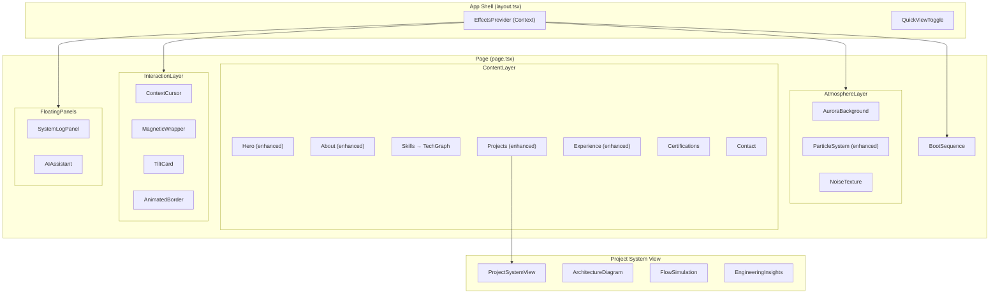
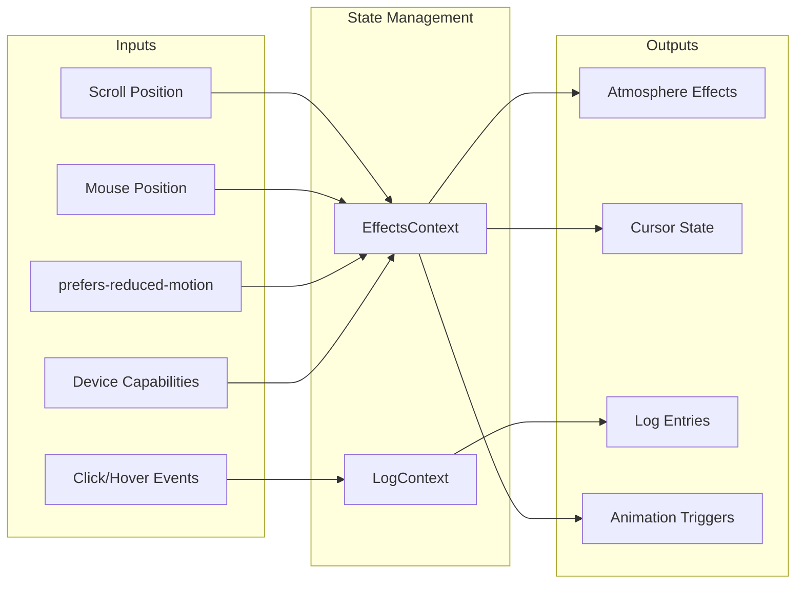

# Design Document: Creative Effects Enhancement

## Overview

This design transforms the existing portfolio from a standard developer site into a "live AI system dashboard" experience. The architecture follows a progressive enhancement strategy: server-rendered content loads first (SSR), then creative effects hydrate on top via dynamically imported client components. All effects are orchestrated by a central performance monitor that can gracefully degrade individual layers.

The system is composed of five architectural layers:
1. **Core Content Layer** — SSR HTML with existing components (unchanged API)
2. **Effect Orchestration Layer** — Performance monitoring, reduced-motion detection, device capability assessment
3. **Atmosphere Layer** — Aurora, particles, grain (purely decorative, z-index behind content)
4. **Interaction Layer** — Cursor, magnetic elements, 3D tilt, log panel (responds to user input)
5. **Feature Layer** — Boot sequence, project system views, tech graph, AI assistant, quick view mode

Each layer can be independently disabled without affecting content readability.

## Architecture

### High-Level Component Hierarchy



### Data Flow



## Components and Interfaces

### 1. EffectsProvider (Context)

Central orchestration context that manages global effects state.

```typescript
// src/contexts/EffectsContext.tsx
interface EffectsState {
  reducedMotion: boolean;
  effectsEnabled: boolean;
  quickViewMode: boolean;
  performanceTier: 'high' | 'medium' | 'low';
  bootCompleted: boolean;
  mousePosition: { x: number; y: number };
  activeSection: string;
}

interface EffectsContextValue extends EffectsState {
  setQuickViewMode: (enabled: boolean) => void;
  setBootCompleted: () => void;
  reportPerformanceDrop: () => void;
  disableEffects: () => void;
}
```

**Responsibilities:**
- Detect `prefers-reduced-motion` via `matchMedia`
- Assess device capabilities (`navigator.hardwareConcurrency`, GPU tier via frame timing)
- Track mouse position (throttled to 16ms via `requestAnimationFrame`)
- Manage quick view toggle state (persisted in `sessionStorage`)
- Monitor frame rate and trigger degradation when sustained drops detected

### 2. LogContext

Manages system log entries independently from effects state.

```typescript
// src/contexts/LogContext.tsx
interface LogEntry {
  id: string;
  timestamp: Date;
  level: 'INFO' | 'OK' | 'AI' | 'ACTION';
  message: string;
}

interface LogContextValue {
  entries: LogEntry[];
  addEntry: (level: LogEntry['level'], message: string) => void;
  isMinimized: boolean;
  toggleMinimize: () => void;
  unreadCount: number;
}
```

**Constraints:**
- Maximum 8 visible entries (FIFO queue)
- Entries are ephemeral (session-only, not persisted)
- Components fire `addEntry` on scroll events, hover, clicks

### 3. BootSequence Component

```typescript
// src/components/effects/BootSequence.tsx
interface BootSequenceProps {
  onComplete: () => void;
}

interface BootMessage {
  text: string;
  delay: number; // ms before this message starts typing
}
```

**Implementation approach:**
- Renders a full-screen terminal overlay with monospace font (`font-mono` / JetBrains Mono)
- Types messages character-by-character using `requestAnimationFrame` + timestamp delta
- Total animation budget: 1500–2000ms
- On completion: cross-fades out (opacity 1→0) while hero content fades in
- Skip logic: checks `sessionStorage.getItem('boot_completed')` on mount
- Reduced motion: renders nothing, calls `onComplete` immediately

### 4. SystemLogPanel Component

```typescript
// src/components/effects/SystemLogPanel.tsx
// Consumes LogContext
// Fixed position: bottom-right on desktop, collapsed on mobile
// Color mapping: INFO=blue, OK=green, AI=yellow, ACTION=purple
```

**Behavior:**
- Desktop: renders open by default, 300px wide
- Mobile (<768px): collapsed to icon with unread badge
- Entries animate in with slide-left + fade
- Older entries fade out when exceeding 8 visible

### 5. ProjectSystemView Component

```typescript
// src/components/effects/ProjectSystemView.tsx
interface ProjectSystemViewProps {
  project: Project;
  architectureData: ProjectArchitecture;
  onClose: () => void;
}

interface ProjectArchitecture {
  nodes: ArchNode[];
  edges: ArchEdge[];
  insights: EngineeringInsight[];
  flowSequence: string[]; // node IDs in flow order
}

interface ArchNode {
  id: string;
  label: string;
  type: 'user' | 'backend' | 'ai' | 'database' | 'external';
  technologies: string[];
  role: string;
  position: { x: number; y: number }; // percentage-based
}

interface ArchEdge {
  from: string;
  to: string;
  label?: string;
}

interface EngineeringInsight {
  question: string; // e.g., "Why Node.js?"
  problem: string;
  decision: string;
  tradeoff: string;
  outcome: string;
}
```

**Rendering approach:**
- SVG-based diagram (not canvas) for accessibility and DOM interaction
- Nodes are positioned using percentage-based coordinates within a responsive container
- Edges rendered as SVG `<path>` elements with animated `stroke-dashoffset` for flow simulation
- Flow pulse: a small circle element animated along the path using `offsetPath` or manual SVG animation
- Engineering insights panel: accordion with framer-motion `AnimatePresence`
- VoiceOwl gets full data (5+ nodes, multiple insights); other projects get simplified (3-4 nodes, 2 insights)

### 6. TechGraph Component

```typescript
// src/components/effects/TechGraph.tsx
interface TechNode {
  id: string;
  name: string;
  category: string;
  proficiency: 'expert' | 'proficient' | 'familiar';
  yearsOfExperience: number;
  relatedProjects: string[];
  connections: string[]; // IDs of connected nodes
}
```

**Implementation approach:**
- SVG-based force-directed layout (simple spring simulation, not d3-force)
- Custom lightweight physics: nodes have positions, velocities; edges act as springs
- Idle state: subtle 2-4px oscillation via sine wave on each node
- Hover: highlighted node and connections at full opacity, others dim to 30%
- Mobile: switch to grouped vertical layout (CSS grid) with expandable category sections
- Tooltip on hover shows proficiency, years, project names

### 7. AIAssistant Component

```typescript
// src/components/effects/AIAssistant.tsx
interface ChatMessage {
  id: string;
  role: 'user' | 'assistant';
  content: string;
  timestamp: Date;
}

interface QuestionPattern {
  patterns: RegExp[];
  response: string;
  category: 'projects' | 'skills' | 'experience' | 'contact' | 'general';
}
```

**Implementation approach:**
- Rule-based keyword matching (no external API)
- Pattern database derived from `projects.ts`, `skills.ts`, `personal.ts`, `experience.ts`
- Typewriter response animation (20-40 chars/sec)
- Maximum 20 messages in history
- Welcome message with 3 clickable suggested questions
- Fallback response directs to relevant sections

### 8. ContextCursor Component

```typescript
// src/components/effects/ContextCursor.tsx
interface CursorState {
  x: number;
  y: number;
  label: string | null;
  scale: number;
  visible: boolean;
}
```

**Implementation:**
- Only renders when `@media (pointer: fine)` matches
- Inner dot (8px) + outer ring (32px) following with 80-120ms spring delay
- Labels: "Explore" on project cards, "Open" on external links, scale 1.5x on buttons
- Uses `pointer-events: none` on cursor elements
- Position tracked via `mousemove` listener on `document`

### 9. MagneticWrapper Component

```typescript
// src/components/effects/MagneticWrapper.tsx
interface MagneticWrapperProps {
  children: React.ReactNode;
  strength?: number; // max px translation, default 8
  radius?: number; // proximity in px, default 60
  disabled?: boolean;
}
```

**Implementation:**
- Wraps CTA buttons and nav links
- Calculates distance from cursor to element center
- Applies CSS transform translate when within radius
- Spring-back animation on exit (300ms ease-out)
- Disabled on touch devices and reduced-motion

### 10. AnimatedBorder Component

```typescript
// src/components/effects/AnimatedBorder.tsx
interface AnimatedBorderProps {
  children: React.ReactNode;
  duration?: number; // cycle duration in seconds, default 4
  className?: string;
}
```

**Implementation:**
- SVG `<rect>` with animated `stroke-dashoffset` creating flowing gradient border
- Gradient transitions between neon-blue and neon-purple
- Hover: doubles animation speed
- Reduced motion: static gradient border via CSS

### 11. TiltCard Component

```typescript
// src/components/effects/TiltCard.tsx
interface TiltCardProps {
  children: React.ReactNode;
  maxRotation?: number; // degrees, default 12
  perspective?: number; // px, default 1000
  className?: string;
}
```

**Implementation:**
- Tracks pointer offset from card center
- Applies `rotateX` and `rotateY` transforms proportional to offset
- On pointer leave: spring back to 0 degrees (400ms ease-out)
- Touch devices: falls back to existing scale hover effect
- CSS `perspective` property on parent container

### 12. QuickViewMode Component

```typescript
// src/components/QuickViewMode.tsx
interface QuickViewData {
  name: string;
  role: string;
  yearsOfExperience: number;
  topSkills: string[];
  projects: { name: string; impact: string }[];
  links: { resume: string; github: string; linkedin: string };
}
```

**Implementation:**
- Renders a clean, single-page summary with no effects
- Reads from existing data files (no network requests)
- Toggle persisted in sessionStorage
- Instant render (<200ms) since data is already in memory

### 13. StaggeredList Component

```typescript
// src/components/effects/StaggeredList.tsx
interface StaggeredListProps {
  children: React.ReactNode[];
  staggerDelay?: number; // ms per item, default 80
  maxDuration?: number; // ms total, default 1200
  animation?: 'fade-up-scale' | 'slide-in';
}
```

**Implementation:**
- Wraps groups of items (project cards, skill nodes, timeline entries)
- Proportionally adjusts delay for groups > 12 items to stay within maxDuration
- Uses IntersectionObserver with `once: true`
- Reduced motion: all children render immediately in final state

### 14. Performance Monitor (Hook)

```typescript
// src/hooks/usePerformanceMonitor.ts
interface PerformanceState {
  fps: number;
  tier: 'high' | 'medium' | 'low';
  shouldDisableEffects: boolean;
}
```

**Implementation:**
- Measures frame timing via `requestAnimationFrame` delta
- Rolling average over 30 frames
- Thresholds:
  - Below 30fps for 500ms → reduce particle complexity (Requirement 7.5)
  - Below 20fps for 1000ms → disable all atmosphere effects (Requirement 14.3)
- Reports to EffectsContext for global degradation decisions

## Data Models

### Extended Types

```typescript
// src/types/effects.ts

export interface ProjectArchitecture {
  nodes: ArchNode[];
  edges: ArchEdge[];
  insights: EngineeringInsight[];
  flowSequence: string[];
}

export interface ArchNode {
  id: string;
  label: string;
  type: 'user' | 'backend' | 'ai' | 'database' | 'external';
  technologies: string[];
  role: string;
  position: { x: number; y: number };
}

export interface ArchEdge {
  from: string;
  to: string;
  label?: string;
}

export interface EngineeringInsight {
  question: string;
  problem: string;
  decision: string;
  tradeoff: string;
  outcome: string;
}

export interface TechNode {
  id: string;
  name: string;
  category: 'Backend' | 'Database' | 'Cloud' | 'AI/Systems';
  proficiency: 'expert' | 'proficient' | 'familiar';
  yearsOfExperience: number;
  relatedProjects: string[];
  connections: string[];
}

export interface LogEntry {
  id: string;
  timestamp: Date;
  level: 'INFO' | 'OK' | 'AI' | 'ACTION';
  message: string;
}

export interface ChatMessage {
  id: string;
  role: 'user' | 'assistant';
  content: string;
  timestamp: Date;
}

export interface QuestionPattern {
  patterns: RegExp[];
  response: string;
  category: 'projects' | 'skills' | 'experience' | 'contact' | 'general';
}

export interface EffectsState {
  reducedMotion: boolean;
  effectsEnabled: boolean;
  quickViewMode: boolean;
  performanceTier: 'high' | 'medium' | 'low';
  bootCompleted: boolean;
  mousePosition: { x: number; y: number };
  activeSection: string;
}

export interface ImpactMetric {
  label: string;
  value: string;
  unit?: string;
}
```

### Data Files (New)

```typescript
// src/data/architectures.ts — Project architecture diagrams data
// src/data/techGraph.ts — Extended skill data with connections and proficiency
// src/data/chatPatterns.ts — AI assistant question-answer patterns
// src/data/bootMessages.ts — Boot sequence messages with brand voice
// src/data/logMessages.ts — Section-specific log messages mapping
```

### Storage Schema

| Key | Storage | Format | Purpose |
|-----|---------|--------|---------|
| `boot_completed` | sessionStorage | `"true"` | Skip boot on revisit |
| `log_minimized` | sessionStorage | `"true"/"false"` | Log panel state |
| `quick_view` | sessionStorage | `"true"/"false"` | Quick view toggle |


## Correctness Properties

*A property is a characteristic or behavior that should hold true across all valid executions of a system — essentially, a formal statement about what the system should do. Properties serve as the bridge between human-readable specifications and machine-verifiable correctness guarantees.*

### Property 1: Typewriter function character output

*For any* string and any elapsed time (in ms) and any typing rate (in chars/sec between 20–50), the typewriter function SHALL return a substring whose length equals `min(floor(elapsed * rate / 1000), string.length)`, and the returned substring SHALL be a prefix of the original string.

**Validates: Requirements 1.1, 5.4**

### Property 2: Boot scheduler duration budget

*For any* array of boot messages (1–10 messages, each 10–60 characters), the boot scheduler function SHALL calculate individual message delays such that the total animation duration (sum of all message type times plus inter-message gaps) falls between 1500ms and 2000ms inclusive.

**Validates: Requirements 1.2**

### Property 3: Character-scramble length preservation and convergence

*For any* target string and any progress value between 0 and 1, the character-scramble function SHALL return a string of exactly the same length as the target. When progress equals 1, the returned string SHALL be identical to the target string.

**Validates: Requirements 1.3**

### Property 4: Particle repulsion force geometry

*For any* particle position (x, y) and mouse position (mx, my), IF the Euclidean distance between them is less than 150px THEN the repulsion function SHALL return a non-zero force vector pointing away from the mouse (dot product of force vector and particle-to-mouse vector is negative). IF the distance is 150px or greater, the force SHALL be zero.

**Validates: Requirements 1.7**

### Property 5: Log message generator produces valid entries

*For any* valid interaction event (section name from the set of page sections, or project object from the projects array), the log message generator SHALL produce a LogEntry with a non-empty message string containing the section or project name, a valid level from {'INFO', 'OK', 'AI', 'ACTION'}, and a timestamp.

**Validates: Requirements 2.2, 2.3**

### Property 6: Bounded queue invariant

*For any* sequence of N items added to a bounded queue with capacity C (where C is 8 for log entries or 20 for chat messages), the queue's visible items array SHALL never have length exceeding C, and the most recently added items SHALL be present in the queue.

**Validates: Requirements 2.4, 5.7**

### Property 7: Log level color mapping is total and deterministic

*For any* log level from the set {'INFO', 'OK', 'AI', 'ACTION'}, the color mapping function SHALL return exactly one color string: 'blue' for INFO, 'green' for OK, 'yellow' for AI, 'purple' for ACTION. The mapping SHALL be deterministic (same input always produces same output).

**Validates: Requirements 2.7**

### Property 8: Architecture diagram renders all provided nodes

*For any* valid ProjectArchitecture object (1–8 nodes, each with non-empty label and valid type), the diagram renderer SHALL produce output containing every node's label text, and the number of rendered node elements SHALL equal the number of nodes in the input data.

**Validates: Requirements 3.2**

### Property 9: Engineering insight structure completeness

*For any* valid EngineeringInsight object (all four fields non-empty), the insight panel renderer SHALL produce output containing the question, problem, decision, tradeoff, and outcome text content.

**Validates: Requirements 3.6**

### Property 10: Tech graph renders all nodes with valid edge references

*For any* valid TechNode array (3–20 nodes) with connections referencing existing node IDs, the graph renderer SHALL produce output containing all node names, and every edge SHALL connect two nodes that both exist in the rendered output.

**Validates: Requirements 4.1**

### Property 11: Graph highlight logic — connected vs dimmed

*For any* tech graph with N nodes (N ≥ 2) and a valid hovered node ID, the highlight function SHALL return the hovered node and all its directly connected nodes as "highlighted" and all remaining nodes as "dimmed". The highlighted set SHALL always include the hovered node, and highlighted ∪ dimmed SHALL equal the full node set.

**Validates: Requirements 4.2**

### Property 12: Tech node tooltip includes required information

*For any* valid TechNode object (with non-empty proficiency, yearsOfExperience > 0, and non-empty relatedProjects array), the tooltip renderer SHALL produce a string containing the proficiency level, years of experience value, and all related project names.

**Validates: Requirements 4.3**

### Property 13: Graph layout clusters nodes by category

*For any* set of TechNodes with at least 2 categories (each having at least 2 nodes), the layout algorithm SHALL position nodes such that the average intra-cluster distance is less than the average inter-cluster distance for all category pairs.

**Validates: Requirements 4.4**

### Property 14: AI pattern matcher returns category-appropriate response

*For any* question string that matches at least one pattern in the pattern database, the matcher SHALL return a non-empty response string from the same category as the matched pattern, and the response SHALL not equal the fallback message.

**Validates: Requirements 5.2**

### Property 15: AI pattern matcher fallback for unmatched input

*For any* string that does not match any pattern in the pattern database (e.g., random alphanumeric strings of length 10–100), the matcher SHALL return the designated fallback response message.

**Validates: Requirements 5.6**

### Property 16: Cursor state resolver maps element types correctly

*For any* element descriptor from the set {'project-card', 'external-link', 'button', 'other'}, the cursor state resolver SHALL return: label "Explore" and scale 1.0 for project-card, label "Open" and scale 1.0 for external-link, label null and scale 1.5 for button, label null and scale 1.0 for other.

**Validates: Requirements 6.2, 6.3, 6.4**

### Property 17: Magnetic element translation calculation

*For any* element center position and cursor position, IF the Euclidean distance is less than 60px THEN the magnetic translation function SHALL return a vector pointing from element toward cursor with magnitude ≤ 8px (proportional to proximity). IF distance ≥ 60px, the translation SHALL be (0, 0).

**Validates: Requirements 6.5**

### Property 18: Particle connection line distance threshold

*For any* two particle positions (x1,y1) and (x2,y2), the shouldDrawLine function SHALL return true if and only if the Euclidean distance between them is strictly less than 120px.

**Validates: Requirements 7.2**

### Property 19: Performance monitor sustained drop detection

*For any* sequence of frame timestamps, IF the rolling average FPS drops below the threshold T (30 for complexity reduction, 20 for full disable) for the specified duration D (500ms or 1000ms respectively), THEN the monitor SHALL report a degradation event. IF FPS remains above the threshold, no degradation SHALL be reported.

**Validates: Requirements 7.5, 14.3**

### Property 20: Stagger delay calculator respects maximum duration

*For any* child count (1–100) and maximum total duration M (1200ms for lists, 800ms for headings), the stagger calculator SHALL produce per-item delays that sum to at most M milliseconds. For child counts ≤ M / baseDelay, each delay SHALL be the configured baseDelay (50–100ms). For larger counts, delays SHALL be proportionally reduced.

**Validates: Requirements 8.1, 8.2, 8.4**

### Property 21: Scroll duration calculator produces clamped values

*For any* scroll distance in pixels (0 to 100000), the scroll duration calculator SHALL return a value between 300ms and 800ms inclusive, monotonically increasing with distance within those bounds.

**Validates: Requirements 8.3**

### Property 22: Tilt angle calculator — proportional and bounded

*For any* card dimensions (width, height > 0), pointer position within the card bounds, and maximum rotation R (default 12 degrees), the tilt calculator SHALL return rotateX and rotateY values where |rotateX| ≤ R and |rotateY| ≤ R. The angles SHALL be proportional to the pointer's offset from the card center.

**Validates: Requirements 9.2**

### Property 23: Device capability assessor feature flags

*For any* hardwareConcurrency value (1–64), when the value is ≤ 2, the capability assessor SHALL return a feature set with particleLines=false, cursorTrail=false, spotlight=false, and flowAutoLoop=false. When > 2, all features SHALL be true.

**Validates: Requirements 10.5**

### Property 24: Quick view data transformer completeness

*For any* valid portfolio data set (personal info, projects array with at least 1 project, skills array with at least 1 skill), the quick view transformer SHALL produce an object containing: a non-empty name, role, top skills (up to 8), project summaries (each with name and impact string), and all required link URLs (resume, github, linkedin).

**Validates: Requirements 12.2**

### Property 25: Project impact data completeness

*For any* project in the projects data array, the project SHALL have an impactMetrics array with at least 2 entries, each containing a non-empty label and a non-empty value string.

**Validates: Requirements 15.1**

### Property 26: Quick view shows exactly one metric per project

*For any* project with N impact metrics (N ≥ 2), the quick view metric selector SHALL return exactly 1 metric from the project's metrics array.

**Validates: Requirements 15.7**

## Error Handling

### Canvas/WebGL Failures

| Failure | Detection | Recovery |
|---------|-----------|----------|
| Canvas context unavailable | `getContext('2d')` returns null | Hide canvas, show static CSS-only particles (dots) |
| WebGL not supported | Feature detection on init | Fall back to 2D canvas or pure CSS effects |
| requestAnimationFrame unavailable | Feature detection | Render single static frame |

### Performance Degradation

| Condition | Threshold | Action |
|-----------|-----------|--------|
| Moderate frame drops | <30fps for 500ms | Reduce particle count, disable connecting lines |
| Severe frame drops | <20fps for 1000ms | Disable all atmosphere effects, switch to static mode |
| Low-end device | ≤2 hardware threads | Preemptively disable expensive effects on mount |

### Data Loading Failures

| Failure | Detection | Recovery |
|---------|-----------|----------|
| Architecture data missing | Null check on project architecture | Show project card without "Explore System" button |
| Skills data malformed | Type validation on mount | Fall back to existing grid layout |
| Chat pattern DB empty | Length check on init | AI assistant shows "unavailable" state |

### User Environment

| Condition | Detection | Behavior |
|-----------|-----------|----------|
| JavaScript disabled | SSR renders all content | Full content visible without effects |
| sessionStorage unavailable | try/catch wrapper | Features work without persistence (boot always plays) |
| Screen reader active | aria-hidden on decorative elements | All content accessible, effects invisible to AT |
| Reduced motion | matchMedia listener | All animations disabled, static equivalents shown |

### Error Boundaries

Each dynamically imported effect component is wrapped in a React Error Boundary that:
1. Catches render errors in the effect
2. Logs the error (console in dev, could be monitoring in prod)
3. Renders nothing (effect disappears gracefully)
4. Does not crash the parent content

## Testing Strategy

### Unit Tests (Example-Based)

Focus areas for example-based unit tests:
- **Component rendering**: BootSequence, SystemLogPanel, AIAssistant, QuickViewMode render correctly with given props
- **Conditional rendering**: Components respect reduced-motion, device capabilities, quick-view mode
- **Keyboard accessibility**: Focus management in AI assistant and Project System View
- **Session persistence**: Boot skip, log panel state, quick view state
- **Data validation**: Architecture data structure, chat pattern database coverage
- **Error boundaries**: Components handle missing data gracefully

Testing tools: Vitest + @testing-library/react + jsdom

### Property-Based Tests

**Library**: fast-check (already installed, v3.23.2)

**Configuration**: Minimum 100 iterations per property test

Each property test maps directly to a Correctness Property above:

| Property | Test Target | Generator Strategy |
|----------|------------|-------------------|
| 1 | `typewriter(str, elapsed, rate)` | Arbitrary strings (1-200 chars), elapsed (0-5000ms), rate (20-50) |
| 2 | `calculateBootSchedule(messages[])` | Arrays of 1-10 strings (10-60 chars each) |
| 3 | `characterScramble(target, progress)` | Arbitrary strings (1-50 chars), float (0-1) |
| 4 | `calculateRepulsion(particle, mouse)` | Two 2D coordinates (0-2000 range) |
| 5 | `generateLogEntry(event)` | Section names and project objects |
| 6 | `BoundedQueue.add(item)` | Sequences of 1-50 items with capacity 8 or 20 |
| 7 | `getLogColor(level)` | One of 4 valid levels |
| 8 | `renderArchDiagram(data)` | Architecture data (1-8 nodes) |
| 9 | `renderInsightPanel(insight)` | EngineeringInsight objects |
| 10 | `renderTechGraph(nodes)` | TechNode arrays (3-20 nodes with valid connections) |
| 11 | `getHighlightedNodes(graph, hoveredId)` | Graph + valid node ID |
| 12 | `renderTooltip(node)` | TechNode objects |
| 13 | `calculateLayout(nodes)` | TechNodes with 2+ categories |
| 14 | `matchQuestion(input)` | Strings matching known patterns |
| 15 | `matchQuestion(input)` | Random non-matching strings |
| 16 | `resolveCursorState(elementType)` | Element type enum values |
| 17 | `calculateMagneticTranslation(elem, cursor)` | Two 2D positions |
| 18 | `shouldDrawLine(p1, p2)` | Two 2D positions |
| 19 | `PerformanceMonitor.update(frameTimes)` | Frame timestamp sequences |
| 20 | `calculateStaggerDelays(count, max)` | Count (1-100), max duration |
| 21 | `calculateScrollDuration(distance)` | Distance (0-100000px) |
| 22 | `calculateTilt(card, pointer, maxRot)` | Card dims, pointer pos, max degrees |
| 23 | `assessDeviceCapabilities(cores)` | Integer (1-64) |
| 24 | `transformToQuickView(data)` | Portfolio data objects |
| 25 | `validateProjectMetrics(project)` | Project objects with metrics |
| 26 | `selectQuickViewMetric(metrics)` | Metrics arrays (2-10 items) |

**Tag format per test:**
```typescript
// Feature: creative-effects-enhancement, Property 1: Typewriter function character output
```

### Integration Tests

- Lighthouse CI for performance scores (desktop 90+, mobile 85+)
- CLS measurement via Web Vitals
- SSR content verification (HTML contains all content without JS)
- Bundle size checks for effect components (<50KB combined gzipped)

### Manual Testing Checklist

- [ ] Reduced motion: all animations disabled
- [ ] Screen reader: all content accessible
- [ ] Low-end device simulation (CPU throttle 4x)
- [ ] JavaScript disabled: content readable
- [ ] Quick View toggle: instant switch, no boot replay
- [ ] Mobile: log panel collapsed, tech graph simplified
- [ ] Cross-browser: Chrome, Firefox, Safari, Edge
