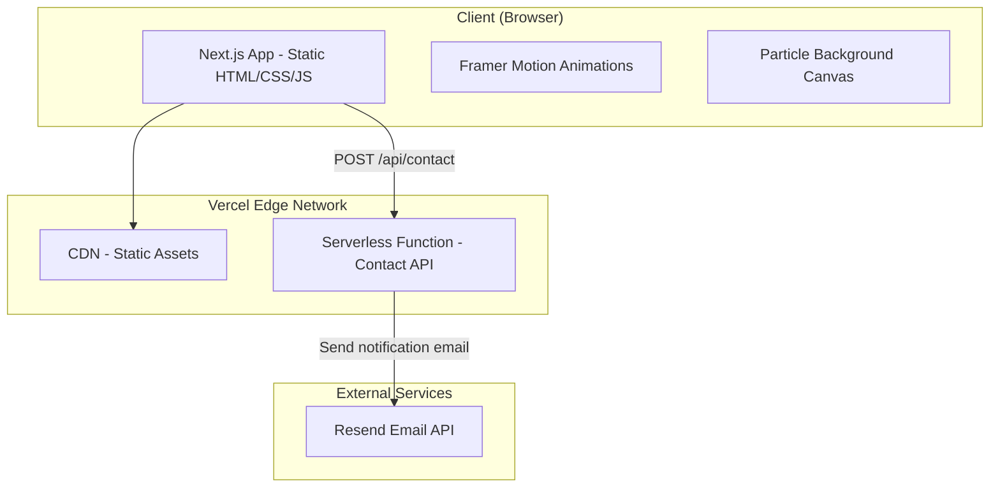
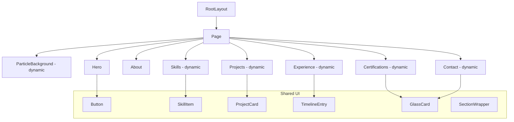

# Design Document: Portfolio Website

## Overview

This design document describes the technical architecture for Rishabh Shrivastava's premium portfolio website — a futuristic, scroll-animated single-page application built with Next.js 14 (App Router), TypeScript, Tailwind CSS, and Framer Motion. The site targets recruiters and hiring managers, delivering a visually striking experience optimized for Vercel free-tier deployment.

The application is a statically-generated single-page site with one server-side API route for contact form processing. All content is externalized into data files, enabling easy updates without touching component code.

### Key Design Decisions

1. **Next.js App Router (v14+)** — Chosen for built-in SSG/SSR, API routes, image optimization, and seamless Vercel deployment.
2. **Static Generation (SSG)** — The portfolio is fully static except the contact API, maximizing performance and staying within free-tier limits.
3. **Framer Motion** — Industry-standard React animation library for scroll-triggered entrance animations and hover effects.
4. **Tailwind CSS** — Utility-first CSS framework for rapid styling with custom theme configuration for the dark/neon aesthetic.
5. **Resend (email service)** — Lightweight email API for contact form processing, with generous free tier (100 emails/day).

## Architecture

### High-Level Architecture



### Rendering Strategy

- **Page**: Static Site Generation (SSG) via `generateStaticParams` — HTML generated at build time
- **Contact API**: Serverless function (Node.js runtime) — processes form submissions
- **Animations**: Client-side only via Framer Motion (hydrates after static HTML loads)
- **Particle Background**: Client-side canvas rendered via dynamic import (no SSR)

### Directory Structure

```
portfolio/
├── src/
│   ├── app/
│   │   ├── layout.tsx          # Root layout with metadata, fonts
│   │   ├── page.tsx            # Main page composing all sections
│   │   └── api/
│   │       └── contact/
│   │           └── route.ts    # Contact form API handler
│   ├── components/
│   │   ├── Hero.tsx
│   │   ├── About.tsx
│   │   ├── Skills.tsx
│   │   ├── Projects.tsx
│   │   ├── Experience.tsx
│   │   ├── Certifications.tsx
│   │   ├── Contact.tsx
│   │   ├── ParticleBackground.tsx
│   │   ├── SectionWrapper.tsx  # Shared scroll-animation wrapper
│   │   └── ui/
│   │       ├── GlassCard.tsx
│   │       ├── Button.tsx
│   │       ├── ProjectCard.tsx
│   │       ├── TimelineEntry.tsx
│   │       └── SkillItem.tsx
│   ├── data/
│   │   ├── projects.ts
│   │   ├── experience.ts
│   │   ├── skills.ts
│   │   ├── certifications.ts
│   │   └── personal.ts        # Name, role, tagline, links
│   ├── lib/
│   │   ├── validators.ts      # Contact form validation logic
│   │   └── email.ts           # Resend email sending utility
│   └── types/
│       └── index.ts            # TypeScript interfaces
├── public/
│   ├── images/
│   │   └── profile.webp
│   ├── resume.pdf
│   ├── sitemap.xml
│   └── robots.txt
├── tailwind.config.ts
├── next.config.js
├── tsconfig.json
├── package.json
└── vercel.json
```

## Components and Interfaces

### Component Hierarchy



### Component Specifications

#### RootLayout (`src/app/layout.tsx`)
- Sets HTML lang, fonts (Inter + JetBrains Mono), global metadata
- Applies dark theme base styles
- Wraps children in semantic `<main>` element

#### Page (`src/app/page.tsx`)
- Composes all section components
- Uses `next/dynamic` for below-the-fold sections (Skills, Projects, Experience, Certifications, Contact)
- Hero and About are statically imported (above the fold)

#### SectionWrapper (`src/components/SectionWrapper.tsx`)
- Reusable Framer Motion wrapper for scroll-triggered entrance animations
- Uses `useInView` hook with `once: true` to trigger animation on viewport entry
- Configurable animation variants (fade-up, fade-left, fade-right)
- Animation duration capped at 600ms per requirement

#### ParticleBackground (`src/components/ParticleBackground.tsx`)
- Canvas-based particle animation (30+ particles)
- Dynamically imported with `ssr: false` to avoid hydration mismatch
- Uses `requestAnimationFrame` for smooth 60fps rendering
- Particles: small circles with low opacity, subtle drift motion
- Fixed positioning behind all content (z-index: 0)

#### Hero (`src/components/Hero.tsx`)
- Renders name, role, tagline from `data/personal.ts`
- Three CTA buttons: View Projects (anchor), Contact Me (anchor), Download Resume (link to PDF)
- Social links: GitHub, LinkedIn (open in new tab with `rel="noopener noreferrer"`)
- Profile image with circular crop, neon glow border, hover scale animation
- Responsive: side-by-side on desktop, stacked on mobile

#### Contact (`src/components/Contact.tsx`)
- Controlled form with client-side validation
- Fields: name (max 100), email (max 254), message (max 1000, min 10)
- Displays inline validation errors adjacent to fields
- Submit button disabled during processing
- Shows success message and clears form on success
- Preserves data and shows error message on failure
- Displays alternative contact links (LinkedIn, GitHub)

#### Contact API (`src/app/api/contact/route.ts`)
- POST handler with request body validation
- Uses Resend SDK to send email notification
- Returns appropriate HTTP status codes (200, 400, 500)
- Execution time well under 10 seconds
- Reads secrets from environment variables

### Key Interfaces

```typescript
// src/types/index.ts

interface PersonalInfo {
  name: string;
  role: string;
  tagline: string;
  github: string;
  linkedin: string;
  resumePath: string;
  profileImage: string;
}

interface Project {
  id: string;
  name: string;
  description: string;
  problem: string;
  solution: string;
  techStack: string[];
  contribution: string;
  impact: string;
  githubUrl: string;
  liveUrl?: string;
  featured: boolean;
}

interface Experience {
  id: string;
  company: string;
  role: string;
  startDate: string;
  endDate: string;
  description: string;
  contributions: string[];
  impact: string;
}

interface Skill {
  name: string;
  category: 'Backend' | 'Database' | 'Cloud' | 'AI/Systems';
}

interface Certification {
  id: string;
  name: string;
  issuer: string;
  date: string;
  verificationUrl?: string;
}

interface ContactFormData {
  name: string;
  email: string;
  message: string;
}

interface ContactFormErrors {
  name?: string;
  email?: string;
  message?: string;
}

interface ApiResponse {
  success: boolean;
  message: string;
}
```

## Data Models

### Content Data Architecture

All content is stored in typed TypeScript data files under `src/data/`. Components iterate over these arrays — adding or modifying entries requires zero component changes.

#### Projects Data (`src/data/projects.ts`)

```typescript
export const projects: Project[] = [
  {
    id: 'voiceowl-ai',
    name: 'VoiceOwl AI',
    description: 'Enterprise AI calling and automation platform',
    problem: 'Manual outbound calling at scale is costly and inconsistent',
    solution: 'AI-driven calling system with real-time SSE dashboards and automation workflows',
    techStack: ['Node.js', 'NestJS', 'MongoDB', 'Server-Sent Events', 'OpenAI', 'Deepgram', 'ElevenLabs'],
    contribution: 'Designed and built the real-time backend architecture and SSE dashboard system',
    impact: '150,000+ daily active users, 2M+ daily API requests',
    githubUrl: 'https://github.com/rish2abh',
    featured: true,
  },
  // ... AgriSoft, Digisparsh
];
```

#### Experience Data (`src/data/experience.ts`)

```typescript
export const experience: Experience[] = [
  {
    id: 'voiceowl',
    company: 'VoiceOwl AI',
    role: 'Backend Developer',
    startDate: 'Apr 2024',
    endDate: 'Present',
    description: 'Built scalable AI calling infrastructure',
    contributions: ['Real-time SSE dashboards', 'AI pipeline integration', 'Microservices architecture'],
    impact: '99.9% uptime, 2M+ daily requests handled',
  },
  // ... MoreYeahs, Codesid (reverse chronological)
];
```

#### Skills Data (`src/data/skills.ts`)

```typescript
export const skills: Skill[] = [
  { name: 'Node.js', category: 'Backend' },
  { name: 'Express', category: 'Backend' },
  { name: 'NestJS', category: 'Backend' },
  { name: 'Hapi', category: 'Backend' },
  { name: 'MongoDB', category: 'Database' },
  { name: 'SQL', category: 'Database' },
  { name: 'AWS S3', category: 'Cloud' },
  { name: 'Cloudinary', category: 'Cloud' },
  { name: 'Prompt Engineering', category: 'AI/Systems' },
  { name: 'Server-Sent Events', category: 'AI/Systems' },
  { name: 'Automation Systems', category: 'AI/Systems' },
];
```

### State Management

No global state management library is needed. Component-local state via `useState` is sufficient:

| Component | State | Type |
|-----------|-------|------|
| Contact | Form data, errors, loading, success | `useState` |
| ParticleBackground | Canvas ref, animation frame | `useRef` |
| SectionWrapper | In-view status | `useInView` (Framer Motion) |
| SkillItem | Hover/tap state | CSS + Framer Motion |

### Tailwind Theme Configuration

```typescript
// tailwind.config.ts (key extensions)
{
  theme: {
    extend: {
      colors: {
        dark: { base: '#0a0a0f', card: 'rgba(255,255,255,0.05)' },
        neon: { blue: '#00d4ff', purple: '#8b5cf6' },
      },
      backdropBlur: { glass: '12px' },
      animation: { 'particle-drift': 'drift 20s infinite linear' },
    },
  },
}
```

## Correctness Properties

*A property is a characteristic or behavior that should hold true across all valid executions of a system — essentially, a formal statement about what the system should do. Properties serve as the bridge between human-readable specifications and machine-verifiable correctness guarantees.*

### Property 1: ProjectCard renders all required fields and conditional elements

*For any* valid Project object (with name 1-100 chars, problem 50-200 chars, solution 50-200 chars, techStack 2-8 items, and optional liveUrl), rendering a ProjectCard SHALL produce output containing the project name, description, all tech stack items, contribution, impact, and GitHub link. Additionally, the live demo link SHALL be present if and only if liveUrl is defined.

**Validates: Requirements 4.3, 4.4**

### Property 2: TimelineEntry renders all required fields

*For any* valid Experience object (with non-empty company, role, dates, description, contributions array, and impact), rendering a TimelineEntry SHALL produce output containing the company name, role title, employment dates, description, all technical contributions, and measurable impact.

**Validates: Requirements 5.2**

### Property 3: CertificationCard renders all required fields and conditional elements

*For any* valid Certification object (with non-empty name, issuer, date, and optional verificationUrl), rendering a CertificationCard SHALL produce output containing the certification name, issuing organization, and date. Additionally, a verification link with `target="_blank"` SHALL be present if and only if verificationUrl is defined.

**Validates: Requirements 6.2, 6.3**

### Property 4: Contact form validation correctness

*For any* ContactFormData object, the validateContactForm function SHALL return an error for the name field if and only if name is empty or contains only whitespace characters; SHALL return an error for the email field if and only if email is empty or does not match the pattern `local@domain.tld`; and SHALL return an error for the message field if and only if message is empty or contains fewer than 10 characters. When all fields are valid, the function SHALL return an empty errors object.

**Validates: Requirements 7.4, 7.5, 7.6**

### Property 5: Data-driven rendering produces one item per data entry

*For any* array of valid data objects (projects, experience, skills, or certifications) of length N (where N ≥ 0), the corresponding section component SHALL render exactly N item elements — no more, no fewer — without requiring any component code modification.

**Validates: Requirements 12.4**

## Error Handling

### Contact Form Errors

| Error Scenario | User-Facing Behavior | Technical Handling |
|---|---|---|
| Client validation failure | Inline error messages adjacent to invalid fields | `validateContactForm()` returns `ContactFormErrors` object; form prevents submission |
| Network failure (API unreachable) | "Unable to send message. Please try again." displayed above form | `fetch` catches network error; form data preserved |
| API returns 400 (bad request) | "Please check your input and try again." | API returns `{ success: false, message }` |
| API returns 500 (server error) | "Something went wrong. Please try again later." | API catches Resend SDK errors; returns 500 with generic message |
| Rate limiting (future) | "Too many requests. Please wait a moment." | Could add rate limiting middleware if needed |

### Contact API Error Handling

```typescript
// src/app/api/contact/route.ts (error handling pattern)
export async function POST(request: Request) {
  try {
    const body = await request.json();
    const errors = validateContactForm(body);
    
    if (Object.keys(errors).length > 0) {
      return Response.json({ success: false, message: 'Validation failed', errors }, { status: 400 });
    }

    await sendEmail(body);
    return Response.json({ success: true, message: 'Message sent successfully' });
  } catch (error) {
    console.error('Contact API error:', error);
    return Response.json({ success: false, message: 'Failed to send message' }, { status: 500 });
  }
}
```

### Graceful Degradation

- **Particle Background fails**: Canvas hidden via error boundary; static gradient background remains
- **Framer Motion fails to load**: Content renders without animation (progressive enhancement)
- **Images fail to load**: Next.js Image shows placeholder/blur; alt text always present
- **Dynamic imports fail**: Error boundary shows section without animation; content still accessible

## Testing Strategy

### Unit Tests (Vitest + React Testing Library)

Unit tests verify specific examples, edge cases, and integration points:

- **Component rendering**: Each section component renders with sample data from data files
- **Metadata**: Verify title, description, OG tags render in layout
- **Semantic HTML**: Verify correct element types (header, main, section, article, footer)
- **Responsive classes**: Verify responsive CSS classes are applied at correct breakpoints
- **API route**: Mock Resend SDK, test success/error paths with specific payloads
- **Conditional rendering**: ProjectCard hides live link when undefined (specific example)
- **Accessibility**: Verify ARIA labels, alt text, focus management

### Property-Based Tests (fast-check)

Property tests verify universal correctness guarantees across generated inputs. Using the `fast-check` library for TypeScript:

- **Minimum 100 iterations** per property test
- **Each test tagged** with design property reference
- **Generators** produce random valid instances of Project, Experience, Certification, ContactFormData

| Property | What it tests | Generator strategy |
|---|---|---|
| Property 1 | ProjectCard field completeness + conditional link | Random Project with varied field lengths, tech stack sizes (2-8), with/without liveUrl |
| Property 2 | TimelineEntry field completeness | Random Experience with varied contribution counts and string lengths |
| Property 3 | CertificationCard field completeness + conditional link | Random Certification with/without verificationUrl |
| Property 4 | Contact form validation rules | Random strings for name (whitespace/non-whitespace), email (valid/invalid formats), message (0-1000 chars) |
| Property 5 | Data-driven array rendering | Random arrays of 0-20 items per data type |

**Tag format**: `Feature: portfolio-website, Property {N}: {title}`

### Integration Tests

- **Contact API end-to-end**: POST to `/api/contact` with mocked Resend, verify response codes
- **Build verification**: `next build` succeeds without errors
- **Lighthouse CI**: Verify performance scores meet thresholds (90 desktop, 85 mobile, CLS ≤ 0.1)

### Test Configuration

```json
{
  "scripts": {
    "test": "vitest run",
    "test:watch": "vitest",
    "test:coverage": "vitest run --coverage"
  }
}
```

Library choices:
- **Vitest** — Fast, native ESM support, works with Next.js
- **@testing-library/react** — Component rendering and assertions
- **fast-check** — Property-based testing library for TypeScript
- **@vitejs/plugin-react** — React support in Vitest

